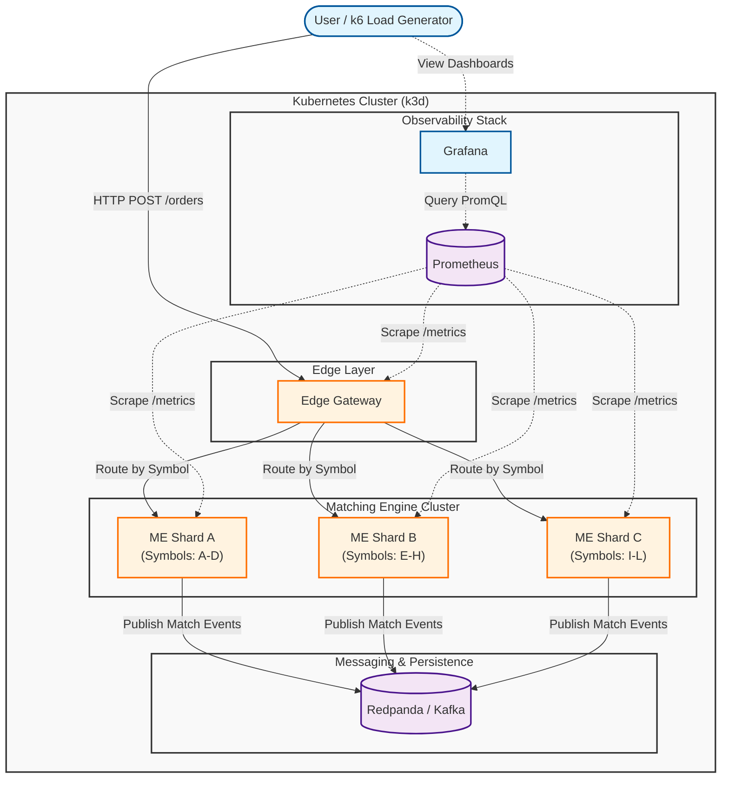
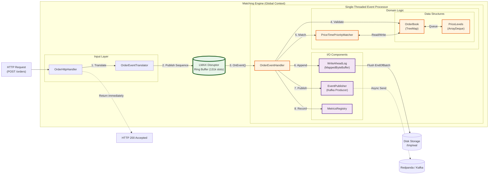

# Component Diagrams

## 1. System Architecture (High Level)

A high-level view showing how user requests flow through the Edge Gateway to the Sharded Matching Engine cluster, and how data flows to downstream systems (Redpanda/Kafka) and observability tools (Prometheus/Grafana).

## 2. Matching Engine Internals (Component Level)

A detailed view of a single Matching Engine instance, highlighting the LMAX Disruptor pattern and the single-threaded event processing pipeline.

