# Matching Engine -- Deployment Diagram Detail and Review

## Table of Contents

1. [Overview](#1-overview)
2. [Deployment Diagram Layers](#2-deployment-diagram-layers)
3. [Relation Analysis and Identified Issues](#3-relation-analysis-and-identified-issues)
4. [Minor Omissions](#4-minor-omissions)
5. [Issues Summary](#5-issues-summary)
6. [Corrected Deployment Diagram](#6-corrected-deployment-diagram)

---

## 1. Overview

This document provides a detailed review of the Deployment Diagram defined in the [Initial Architecture (Section 5)](./initial-architecture.md#5-view-3-deployment-view). It explains each layer, traces every relation, and identifies correctness issues in the wiring between components.

The deployment diagram is organized in 6 layers: Client Layer, Edge/Ingress, Kubernetes Cluster (Stateless Tier, Matching Engine Tier, Message Broker, Async Services), Data Stores, and Observability. The review found **7 issues** in the diagram's relations, 3 of which are architecturally significant because they misrepresent the actual data flow.

---

## 2. Deployment Diagram Layers

### 2.1 Layer 1: Client Layer

| Component | Description |
|:---|:---|
| **Web/Mobile Clients** | End-user traders accessing the platform via HTTPS or WebSocket connections. |
| **FIX Protocol Clients** | Institutional clients using the Financial Information eXchange protocol for order submission. |

Both client types connect to the L4/L7 Load Balancer as the single entry point.

### 2.2 Layer 2: Edge / Ingress

| Component | Description |
|:---|:---|
| **L4/L7 Load Balancer (HAProxy / AWS NLB)** | Distributes client connections across API Gateway pods. Performs TLS termination and health checks. L4 (TCP-level) is selected for lowest latency. |

The Load Balancer fans out to all API Gateway pods (1, 2, ..., N). This is correct -- the LB is the only public-facing entry point.

### 2.3 Layer 3: Kubernetes Cluster -- Stateless Tier (HPA Enabled)

| Component | Scaling | Description |
|:---|:---|:---|
| **API Gateway Pods (1..N)** | HPA: 2-10 pods, CPU target 60% | Stateless. Handles authentication (JWT/API key validation via Redis), rate limiting (Redis counters), and request routing to Order Gateway pods. |
| **Order Gateway Pods (1..N)** | HPA: 2-8 pods, CPU target 60% | Stateless. Handles protocol translation (REST/WebSocket/FIX to internal format), input schema validation, idempotency checks (via Redis), and order sequencing. Routes orders to the correct ME shard by symbol hash. |

Both tiers are stateless and horizontally auto-scaled by Kubernetes HPA. Any API Gateway pod can route to any Order Gateway pod, and any Order Gateway pod can route to any Matching Engine shard.

### 2.4 Layer 4: Matching Engine Tier (Sharded, Stateful)

| Component | Scaling | Description |
|:---|:---|:---|
| **ME Shard A (AAPL, GOOG, ...)** | Manual | Single-threaded event processor with in-memory Order Books for Shard A symbols. Dedicated WAL Volume A (Local SSD / EBS io2). |
| **ME Shard B (MSFT, AMZN, ...)** | Manual | Same as Shard A, for Shard B symbols. Dedicated WAL Volume B. |
| **ME Shard C (TSLA, META, ...)** | Manual | Same as Shard A, for Shard C symbols. Dedicated WAL Volume C. |

Each shard is an independent process with its own Ring Buffer, in-memory Order Books, WAL volume, and handler chain. Shards are NOT auto-scaled -- shard count is managed via operational runbook because adding a shard requires symbol rebalancing and WAL replay. Symbols are assigned to shards via consistent hashing (`Hash(symbol) mod N`).

### 2.5 Layer 5: Message Broker Cluster + Async Services

| Component | Scaling | Description |
|:---|:---|:---|
| **Kafka/Redpanda Brokers (1, 2, 3)** | Fixed cluster | Durable, partitioned event bus. Topics partitioned by asset symbol (e.g., `orders.AAPL`, `matches.AAPL`). Replication factor = 3. Producers and consumers connect to the cluster; the Kafka client routes to the correct partition leader. |
| **Notification Dispatcher Pod 1 (Premium)** | HPA: 2-6 pods, lag target < 1000 | Consumes events from Kafka and pushes near-real-time WebSocket notifications to Premium subscribers. |
| **Notification Dispatcher Pod 2 (Basic/Batch)** | HPA: 2-6 pods, lag target < 1000 | Consumes events from Kafka and delivers batched/delayed notifications to Basic subscribers. |
| **Analytics Service Pods (1, 2)** | HPA: 1-4 pods, CPU/lag | Consumes all events from Kafka, builds materialized views and aggregates, writes to the OLAP store. |

All async services are stateless Kafka consumers that can be freely auto-scaled by HPA.

### 2.6 Layer 6: Data Stores + Observability

| Component | Description |
|:---|:---|
| **Redis Cluster** | Session cache, idempotency keys, rate limit counters. Used by API Gateway (and Order Gateway for idempotency). NOT on the matching critical path. |
| **ClickHouse / TimescaleDB** | OLAP database for the Analytics Service. Stores historical trades, Order Book snapshots, and aggregated metrics. |
| **Object Storage (S3)** | Long-term archive of WAL segments and event store snapshots. Disaster recovery and regulatory compliance. 11 nines durability. |
| **Prometheus + Grafana** | Metrics collection, dashboards, and alerting. All components export metrics. |
| **Jaeger / Tempo** | Distributed tracing with correlation ID propagation for end-to-end latency analysis. |

---

## 3. Relation Analysis and Identified Issues

### 3.1 Issue 1: API Gateway to Order Gateway Is 1:1 (Should Be Many-to-Many)

**Current diagram wiring:**

```
APIGW1 --> OGW1
APIGW2 --> OGW2
APIGWN --> OGWN
```

**Problem:** This shows a rigid 1:1 mapping between API Gateway pods and Order Gateway pods. However, both tiers are **stateless**. Any API Gateway pod should be able to route to **any** Order Gateway pod via an internal Kubernetes Service. The 1:1 mapping contradicts the stateless design described in Section 5.3 of the initial architecture, which states the Order Gateway is a *"Stateless routing layer. Each pod can route to any shard."*

**Correct behavior:** The API Gateway pods should connect to a Kubernetes Service (e.g., `order-gateway-svc`) that load-balances across all Order Gateway pods. Alternatively, the diagram should show every APIGW pod connecting to every OGW pod.

**Severity:** High -- misrepresents the routing topology and suggests a single point of failure (if OGW1 goes down, APIGW1 has no other target).

### 3.2 Issue 2: APIGWN Is Missing Its Redis Connection

**Current diagram wiring:**

```
APIGW1 --> Redis
APIGW2 --> Redis
(APIGWN --> Redis is MISSING)
```

**Problem:** All API Gateway pods need Redis for session validation, rate limiting, and idempotency key checks. The `APIGWN --> Redis` connection is omitted.

**Severity:** Low -- clearly an omission rather than a design flaw. All pods in the same tier have identical behavior.

### 3.3 Issue 3: Order Gateway to ME Connections Are Incomplete

**Current diagram wiring:**

```
OGW1 -->|"Route by Symbol Hash"| ME_A
OGW1 -->|"Route by Symbol Hash"| ME_B
OGW2 -->|"Route by Symbol Hash"| ME_C
OGWN -->|"Route by Symbol Hash"| ME_A
```

**Problem:** The HPA table in Section 5.3 explicitly states: *"Each pod can route to any shard."* But the diagram shows:

| OGW Pod | Connects to | Missing |
|:---|:---|:---|
| OGW1 | ME_A, ME_B | **ME_C** |
| OGW2 | ME_C | **ME_A, ME_B** |
| OGWN | ME_A | **ME_B, ME_C** |

**Every Order Gateway pod must connect to every ME shard.** An order for TSLA (Shard C) arriving at OGW1 must be able to reach ME_C, but the diagram shows no such path. Similarly, an order for AAPL arriving at OGW2 has no path to ME_A.

**Severity:** High -- this misrepresents the symbol-based routing and creates apparent dead-ends for certain order/gateway combinations.

### 3.4 Issue 4: ME to Kafka Is 1:1 (Should Be Many-to-Many)

**Current diagram wiring:**

```
ME_A --> K1
ME_B --> K2
ME_C --> K3
```

**Problem:** This implies each ME instance only produces to a specific Kafka broker. That is **not how Kafka works**. Kafka producers connect to the cluster, and the client library routes each message to whichever broker is the partition leader for the target topic-partition. For example, if the partition leader for `matches.AAPL` happens to be on K2, then ME_A (which handles AAPL) must produce to K2, not K1.

**Correct behavior:** All ME instances should connect to the Kafka cluster as a whole. The diagram should show each ME connecting to the broker cluster (or to all brokers), not a 1:1 mapping.

**Severity:** Medium -- misleading about Kafka's partition leadership model, though functionally the events would still reach Kafka if the cluster is healthy.

### 3.5 Issue 5: Kafka to Consumer Connections Are 1:1 and Incomplete

**Current diagram wiring:**

```
K1 --> ND1
K2 --> ND2
K3 --> AS1
K1 --> AS2
```

**Problem (a): Incorrect Kafka topology.** Kafka consumers connect to the cluster and are assigned partitions by the consumer group coordinator. They consume from partition leaders regardless of which broker hosts them. The 1:1 mapping broker-to-consumer is misleading.

**Problem (b): Incomplete event consumption.** The current wiring implies:

| Consumer | Receives events from | Missing events from |
|:---|:---|:---|
| ND1 (Premium) | K1 only (ME_A events) | **K2 (ME_B), K3 (ME_C)** |
| ND2 (Basic) | K2 only (ME_B events) | **K1 (ME_A), K3 (ME_C)** |
| AS1 | K3 only (ME_C events) | **K1 (ME_A), K2 (ME_B)** |
| AS2 | K1 only (ME_A events) | **K2 (ME_B), K3 (ME_C)** |

This means:
- **Subscribers to symbols on Shard C never receive Premium notifications** (ND1 only gets K1 events).
- **Subscribers to symbols on Shard A and Shard C never receive Basic notifications** (ND2 only gets K2 events).
- **The Analytics Service never aggregates a complete picture** of all trades.

**Correct behavior:** Both Notification Dispatcher pods and both Analytics Service pods should consume from **all** Kafka partitions via consumer groups. Each consumer connects to the Kafka cluster, and the group coordinator assigns partitions across pod replicas.

**Severity:** High -- this is the most significant issue. It misrepresents the event consumption model and implies that notifications and analytics are incomplete for certain symbols.

### 3.6 Issue 6: WAL Backup to S3 Only Shown for Shard A

**Current diagram wiring:**

```
ME_A -.->|"WAL Backup"| ObjStore
(ME_B and ME_C backup connections are MISSING)
```

**Problem:** All shards need WAL archival to S3 for disaster recovery and regulatory compliance. The backup connections for ME_B and ME_C are omitted.

**Severity:** Low -- clearly an omission. All shards have identical operational requirements.

### 3.7 Issue 7: Event Store Is Missing from the Deployment Diagram

**Problem:** The Structural View (Section 3.1 of the initial architecture) defines an **Event Store** component:

> *"Event Store (Append-Only Log, Source of Truth for Replay)"* -- consuming all events from Kafka.

The component responsibilities table in Section 3.3 describes it as:

> *"Append-only log of all domain events. Enables replay, audit, and system recovery."*

However, the deployment diagram has **no Event Store pod or service**. It should be deployed in the Async Services Tier alongside the Notification Dispatcher and Analytics Service, consuming from all Kafka partitions.

**Severity:** Medium -- the Event Store is described as the "source of truth for replay" and is critical for crash recovery and audit. Its absence from the deployment view means there is no deployment plan for a component that the structural view depends on.

---

## 4. Minor Omissions

| Issue | Description |
|:---|:---|
| **Observability connections incomplete** | Only ME_A/B/C connect to Prometheus and only ND1 and AS1 connect to Jaeger. In practice, all components (OGW pods, APIGW pods, ND2, AS2) should emit metrics and traces. |
| **KTopic node is disconnected** | The `KTopic` label node describing topic partitioning has no edges -- it is a floating annotation. Not incorrect, but potentially confusing in the diagram. |
| **No Kubernetes Service shown between stateless tiers** | Between APIGW and OGW tiers, there should logically be a Kubernetes Service for internal load balancing. The diagram jumps directly from pod to pod, which does not reflect K8s networking reality. |
| **Order Gateway to Redis not shown** | The Order Gateway performs idempotency checks using keys stored in Redis, but no OGW-to-Redis connection is shown. |

---

## 5. Issues Summary

| # | Issue | Severity | Description |
|:---|:---|:---|:---|
| 1 | APIGW -> OGW is 1:1 | **High** | Should be many-to-many via K8s Service; 1:1 mapping implies single point of failure. |
| 2 | APIGWN -> Redis missing | Low | Omission; all APIGW pods need Redis. |
| 3 | OGW -> ME connections incomplete | **High** | Every OGW pod must connect to every ME shard for symbol-based routing to work. |
| 4 | ME -> Kafka is 1:1 | Medium | Kafka producers connect to the cluster, not to specific brokers. |
| 5 | Kafka -> consumers is 1:1 and incomplete | **High** | Consumers must read all partitions; current wiring leaves symbols without notification or analytics coverage. |
| 6 | WAL backup only for ME_A | Low | ME_B and ME_C also need S3 backup. |
| 7 | Event Store missing from deployment | Medium | Structural view defines it; deployment view omits it. |

---

## 6. Corrected Deployment Diagram

The following diagram addresses all 7 issues identified above:

- API Gateway pods connect to Order Gateway pods through a **Kubernetes Service** (many-to-many).
- All API Gateway pods connect to Redis.
- All Order Gateway pods connect to **all** ME shards (symbol-based routing).
- All ME instances connect to the **Kafka cluster** (not individual brokers).
- All consumers (Notification Dispatcher, Analytics Service, Event Store) connect to the **Kafka cluster**.
- All ME instances back up WAL to S3.
- An **Event Store** service is added to the Async Services Tier.

```mermaid
graph TB
    subgraph "Client Layer"
        WebClient["Web/Mobile Clients"]
        FIXClient["FIX Protocol Clients"]
    end

    subgraph "Edge / Ingress"
        LB["L4/L7 Load Balancer<br/>(HAProxy / AWS NLB)<br/>Health Checks, TLS Termination"]
    end

    subgraph "Kubernetes Cluster"
        subgraph "Stateless Tier (HPA Enabled)"
            APIGW1["API Gateway<br/>Pod 1"]
            APIGW2["API Gateway<br/>Pod 2"]
            APIGWN["API Gateway<br/>Pod N"]

            OGW_SVC["Order Gateway<br/>K8s Service<br/>(Internal LB)"]

            OGW1["Order Gateway<br/>Pod 1"]
            OGW2["Order Gateway<br/>Pod 2"]
            OGWN["Order Gateway<br/>Pod N"]
        end

        subgraph "Matching Engine Tier (Sharded, Stateful)"
            subgraph "Shard A (Symbols: AAPL, GOOG, ...)"
                ME_A["ME Instance A<br/>(Single Thread)<br/>In-Memory OrderBooks<br/>for Shard A symbols"]
                WAL_A["WAL Volume A<br/>(Local SSD / EBS io2)"]
            end
            subgraph "Shard B (Symbols: MSFT, AMZN, ...)"
                ME_B["ME Instance B<br/>(Single Thread)<br/>In-Memory OrderBooks<br/>for Shard B symbols"]
                WAL_B["WAL Volume B<br/>(Local SSD / EBS io2)"]
            end
            subgraph "Shard C (Symbols: TSLA, META, ...)"
                ME_C["ME Instance C<br/>(Single Thread)<br/>In-Memory OrderBooks<br/>for Shard C symbols"]
                WAL_C["WAL Volume C<br/>(Local SSD / EBS io2)"]
            end
        end

        subgraph "Message Broker Cluster"
            KAFKA["Kafka / Redpanda Cluster<br/>(3 Brokers, RF=3)<br/>Topics Partitioned<br/>by Asset Symbol"]
        end

        subgraph "Async Services Tier (HPA Enabled)"
            ND1["Notification Dispatcher<br/>Pod 1 (Premium)"]
            ND2["Notification Dispatcher<br/>Pod 2 (Basic/Batch)"]
            AS1["Analytics Service<br/>Pod 1"]
            AS2["Analytics Service<br/>Pod 2"]
            EVS["Event Store<br/>Pod 1<br/>(Append-Only Log,<br/>Source of Truth for Replay)"]
        end
    end

    subgraph "Data Stores"
        Redis["Redis Cluster<br/>(Session Cache,<br/>Idempotency Keys,<br/>Rate Limit Counters)"]
        OLAP["ClickHouse / TimescaleDB<br/>(Analytics OLAP Store)"]
        ObjStore["Object Storage (S3)<br/>(Event Archive,<br/>Long-term WAL Backup)"]
    end

    subgraph "Observability"
        Prom["Prometheus + Grafana<br/>(Metrics, Dashboards)"]
        Jaeger["Jaeger / Tempo<br/>(Distributed Tracing)"]
    end

    %% Client to Edge
    WebClient --> LB
    FIXClient --> LB

    %% Edge to API Gateway (fan-out)
    LB --> APIGW1
    LB --> APIGW2
    LB --> APIGWN

    %% API Gateway to Redis (ALL pods)
    APIGW1 --> Redis
    APIGW2 --> Redis
    APIGWN --> Redis

    %% API Gateway to Order Gateway via K8s Service (many-to-many)
    APIGW1 --> OGW_SVC
    APIGW2 --> OGW_SVC
    APIGWN --> OGW_SVC
    OGW_SVC --> OGW1
    OGW_SVC --> OGW2
    OGW_SVC --> OGWN

    %% Order Gateway to ALL ME Shards (symbol-based routing)
    OGW1 -->|"Route by Symbol Hash"| ME_A
    OGW1 -->|"Route by Symbol Hash"| ME_B
    OGW1 -->|"Route by Symbol Hash"| ME_C
    OGW2 -->|"Route by Symbol Hash"| ME_A
    OGW2 -->|"Route by Symbol Hash"| ME_B
    OGW2 -->|"Route by Symbol Hash"| ME_C
    OGWN -->|"Route by Symbol Hash"| ME_A
    OGWN -->|"Route by Symbol Hash"| ME_B
    OGWN -->|"Route by Symbol Hash"| ME_C

    %% ME to WAL (each shard to its own volume)
    ME_A --> WAL_A
    ME_B --> WAL_B
    ME_C --> WAL_C

    %% ME to Kafka Cluster (ALL instances to cluster)
    ME_A -->|"Publish Events<br/>(Async)"| KAFKA
    ME_B -->|"Publish Events<br/>(Async)"| KAFKA
    ME_C -->|"Publish Events<br/>(Async)"| KAFKA

    %% Kafka to ALL Consumers (consumer groups)
    KAFKA -->|"OrderPlaced,<br/>MatchExecuted,<br/>OrderCancelled"| ND1
    KAFKA -->|"OrderPlaced,<br/>MatchExecuted,<br/>OrderCancelled"| ND2
    KAFKA -->|"All Events"| AS1
    KAFKA -->|"All Events"| AS2
    KAFKA -->|"All Events"| EVS

    %% Analytics to OLAP
    AS1 --> OLAP
    AS2 --> OLAP

    %% WAL Backup to S3 (ALL shards)
    ME_A -.->|"WAL Backup"| ObjStore
    ME_B -.->|"WAL Backup"| ObjStore
    ME_C -.->|"WAL Backup"| ObjStore

    %% Event Store to S3
    EVS -.->|"Event Archive"| ObjStore

    %% Observability (all components)
    ME_A -.-> Prom
    ME_B -.-> Prom
    ME_C -.-> Prom
    ND1 -.-> Prom
    ND2 -.-> Prom
    AS1 -.-> Prom
    AS2 -.-> Prom
    EVS -.-> Prom

    ME_A -.-> Jaeger
    ME_B -.-> Jaeger
    ME_C -.-> Jaeger
    ND1 -.-> Jaeger
    ND2 -.-> Jaeger
    AS1 -.-> Jaeger
    AS2 -.-> Jaeger
    EVS -.-> Jaeger

    %% Styling
    style ME_A fill:#c41e3a,stroke:#8b0000,color:#ffffff
    style ME_B fill:#c41e3a,stroke:#8b0000,color:#ffffff
    style ME_C fill:#c41e3a,stroke:#8b0000,color:#ffffff
    style KAFKA fill:#4682b4,stroke:#2f4f4f,color:#ffffff
    style OGW_SVC fill:#2e8b57,stroke:#1a5632,color:#ffffff
    style EVS fill:#708090,stroke:#2f4f4f,color:#ffffff
    style ND1 fill:#708090,stroke:#2f4f4f,color:#ffffff
    style ND2 fill:#708090,stroke:#2f4f4f,color:#ffffff
    style AS1 fill:#708090,stroke:#2f4f4f,color:#ffffff
    style AS2 fill:#708090,stroke:#2f4f4f,color:#ffffff
```



### Key Corrections Applied

| # | Original Issue | Correction |
|:---|:---|:---|
| 1 | APIGW -> OGW was 1:1 | Added a **K8s Service** (`OGW_SVC`) between APIGW and OGW tiers for many-to-many routing. |
| 2 | APIGWN -> Redis missing | Added `APIGWN --> Redis` connection. |
| 3 | OGW -> ME incomplete | Every OGW pod now connects to **every** ME shard (9 connections total for 3 OGW x 3 ME). |
| 4 | ME -> Kafka was 1:1 | Replaced 3 individual broker nodes with a single **Kafka Cluster** node. All ME instances connect to the cluster. |
| 5 | Kafka -> consumers was 1:1 and incomplete | All consumers (ND1, ND2, AS1, AS2, EVS) connect to the **Kafka Cluster** and consume from all partitions via consumer groups. |
| 6 | WAL backup only for ME_A | Added `ME_B` and `ME_C` backup connections to S3. |
| 7 | Event Store missing | Added **Event Store Pod** in the Async Services Tier, consuming from Kafka and archiving to S3. |

---

*Parent document: [Initial Architecture](./initial-architecture.md)*
*Related: [Matching Engine Component Detail](./matching-engine-component-detail.md)*