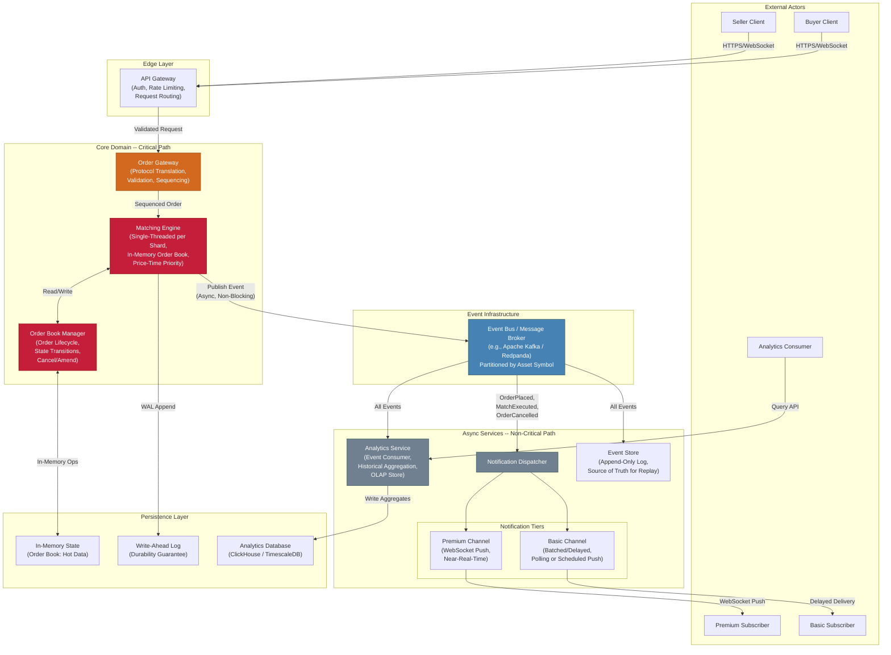
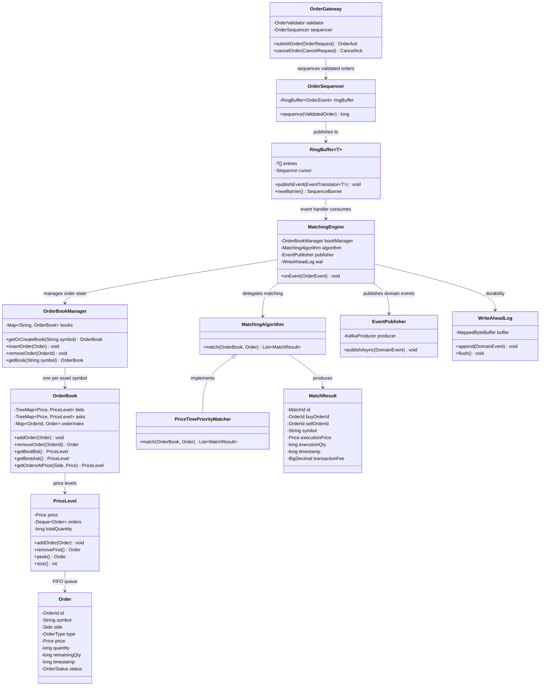
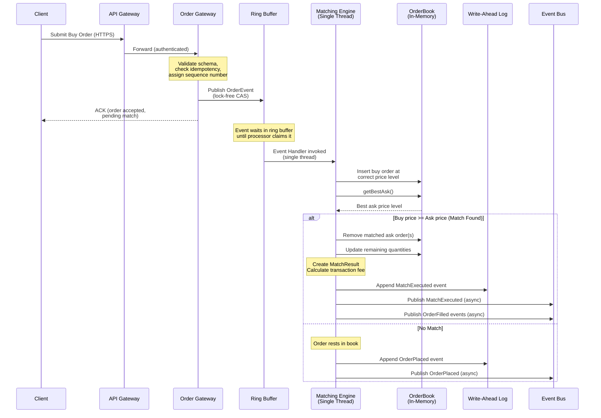
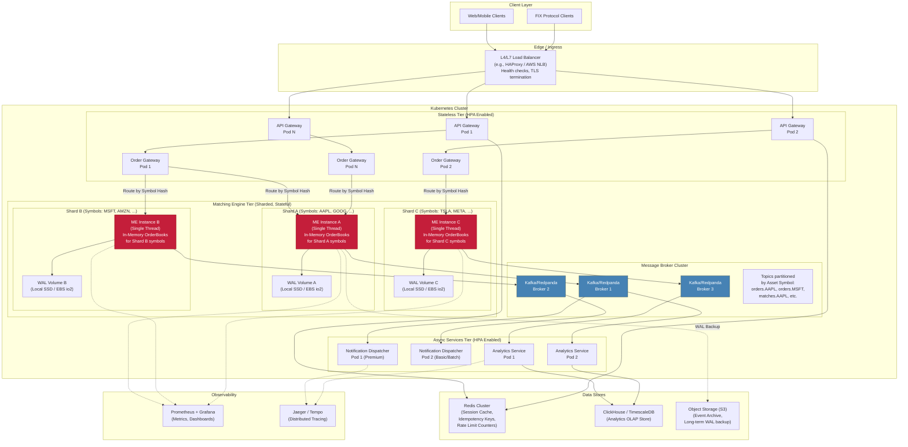

# Matching Engine -- Initial Architectural Design

## Table of Contents

1. [Executive Summary](#1-executive-summary)
2. [Requirements Recap and Latency Budget](#2-requirements-recap-and-latency-budget)
3. [View 1: Structural View (Component Diagram)](#3-view-1-structural-view)
4. [View 2: Component-Connector / Concurrency View](#4-view-2-component-connector--concurrency-view)
5. [View 3: Deployment View](#5-view-3-deployment-view)
6. [Cross-Cutting Concerns](#6-cross-cutting-concerns)
7. [Risks and Mitigations](#7-risks-and-mitigations)
8. [Phased Implementation Roadmap](#8-phased-implementation-roadmap)

---

## 1. Executive Summary

This document presents the initial architecture for a Matching Engine (ME) system that acts as a third-party exchange intermediary, managing the trading of assets between buyers and sellers through a centralized Order Book. The architecture is driven by two primary quality attributes: **low latency** (sub-200ms matching, sub-500ms order registration) and **horizontal scalability** (from 1,000 to 5,000 matches/min during peak bursts).

The design follows three foundational principles:

1. **Single-Threaded Matching Core with Mechanical Sympathy** -- Eliminates lock contention on the critical path by sequencing all Order Book mutations through a single-threaded event loop per shard, inspired by the LMAX Disruptor pattern.
2. **Event-Driven Decoupling** -- Notification and Analytics services consume events asynchronously via a message broker, ensuring they never contribute latency to the critical matching path.
3. **Asset-Symbol Sharding** -- Order Books are partitioned by asset symbol across independent matching engine instances, enabling linear horizontal scaling with no global coordination.

---

## 2. Requirements Recap and Latency Budget

### 2.1 Latency Targets

| Operation | Target (p99) | Notes |
|:---|:---|:---|
| Sell offer registration and availability | < 500 ms | Includes validation, persistence, and Order Book insertion |
| Buy offer registration and availability | < 300 ms | Includes validation, persistence, and Order Book insertion |
| Matching execution and transaction completion | < 200 ms | From order arrival at matching engine to match result committed |

### 2.2 Throughput Targets

| Metric | Normal | Peak (5x burst, up to 30 min) |
|:---|:---|:---|
| Sell orders ingested | 500/min (~8.3/sec) | 2,500/min (~42/sec) |
| Buy orders ingested | 800/min (~13.3/sec) | 4,000/min (~67/sec) |
| Matches executed | 1,000/min (~16.7/sec) | 5,000/min (~83/sec) |

**Observation:** These throughput numbers are moderate. A single well-optimized matching engine instance can handle tens of thousands of matches per second. The architecture must scale to 5x peak, but should not introduce the complexity of internet-scale systems. Right-sizing is critical.

### 2.3 Latency Budget for the Critical Path (Matching Execution < 200 ms)

The matching execution critical path -- from the moment an order arrives at the Matching Engine boundary to the moment a match result is committed -- is budgeted as follows:

```
Order arrives at Matching Engine boundary
  |
  |-- [1] Deserialize inbound message .............. ~1 ms
  |-- [2] Enqueue into Disruptor ring buffer ....... ~0.01 ms (lock-free CAS)
  |-- [3] Order validation (business rules) ........ ~2 ms
  |-- [4] Order Book insertion (in-memory sorted
  |       structure: TreeMap or skip list) ......... ~0.05 ms
  |-- [5] Matching algorithm execution (price-time
  |       priority scan and fill) .................. ~1-5 ms
  |-- [6] Generate MatchResult + update balances ... ~0.5 ms
  |-- [7] Append to Event Store / WAL (async
  |       flush, memory-mapped or batched) ......... ~5-20 ms
  |-- [8] Publish match event to broker (async,
  |       fire-and-forget to local buffer) ......... ~0.5 ms
  |
  Total critical path (p99 estimate) ............... ~30 ms
  Remaining headroom to 200 ms target .............. ~170 ms
```

The budget shows substantial headroom. This headroom absorbs: (a) GC pauses if using a JVM-based runtime, (b) network transit time from the Order Gateway to the Matching Engine, and (c) tail latency from the WAL flush under contention. Even under pessimistic conditions, the 200 ms target is achievable.

**Note:** The order registration latency targets (300-500 ms) are less aggressive and include additional steps such as API Gateway processing, authentication, input validation, and the network round-trip from client to gateway. These are comfortably within budget given the matching path is under 30 ms.

---

## 3. View 1: Structural View

### 3.1 Component Diagram



### 3.2 Critical Path Identification

The **Critical Path** traverses exactly these components, in sequence:

```
Client --> API Gateway --> Order Gateway --> Matching Engine <--> Order Book Manager --> [WAL Append]
```

Everything to the right of the `Publish Event` arrow is **off the critical path**. The Notification Dispatcher, Analytics Service, and Event Store consume events asynchronously. A failure or slowdown in any of these services has zero impact on matching latency.

### 3.3 Component Responsibilities

| Component | Responsibility | Critical Path? |
|:---|:---|:---|
| **API Gateway** | Authentication, TLS termination, rate limiting, request routing. Stateless. | Yes (ingress only) |
| **Order Gateway** | Protocol translation (REST/WebSocket/FIX to internal format), input schema validation, idempotency checks, order sequencing. | Yes |
| **Matching Engine** | Core matching logic. Receives sequenced orders, executes price-time priority algorithm against in-memory Order Book, produces match results. Single-threaded per shard. | **Yes -- Innermost Critical Path** |
| **Order Book Manager** | Manages Order Book data structure lifecycle: insert, cancel, amend, partial fill updates. Tightly coupled to Matching Engine (same process). | **Yes** |
| **Event Bus (Kafka/Redpanda)** | Durable, partitioned event stream. Decouples producers (ME) from consumers (Notification, Analytics). Partitioned by asset symbol for ordering guarantees per instrument. | No (async publish) |
| **Notification Dispatcher** | Consumes Order Book events and routes them to subscribers. Premium tier: push immediately via WebSocket. Basic tier: batch and delay. | No |
| **Analytics Service** | Consumes all events, builds materialized views and aggregates for historical queries. Writes to OLAP store. | No |
| **Event Store** | Append-only log of all domain events. Enables replay, audit, and system recovery. | No (async) |

### 3.4 Design Rationale -- Structural View

**Decision 1: Event-Driven Architecture (EDA) for decoupling.**
- *Why:* The CLAUDE.md guidance explicitly requires that Notification and Analytics services must not increase latency of the core Matching Engine. By publishing events to a broker asynchronously (fire-and-forget from the ME perspective), these downstream services are fully decoupled. The ME does not wait for acknowledgment from Kafka before returning a match result.
- *Trade-off:* Eventual consistency. Subscribers will see Order Book updates with a small delay (typically 10-50 ms for Premium, seconds to minutes for Basic). This is acceptable per the tiered revenue model.

**Decision 2: Order Gateway as a separate component from Matching Engine.**
- *Why:* The Order Gateway handles concerns that are orthogonal to matching: protocol translation, authentication propagation, input validation, idempotency. Separating it allows the Matching Engine to remain a lean, focused component that does one thing: match orders. It also allows the Order Gateway to be scaled independently (it is stateless and handles higher request cardinality than matching events).
- *Trade-off:* One additional network hop on the critical path (~0.5 ms intra-cluster). Acceptable given the 170 ms headroom.

**Decision 3: Matching Engine and Order Book Manager are co-located in the same process.**
- *Why:* The Order Book is the hot data structure that the Matching Engine reads and writes on every operation. Placing them in the same process eliminates serialization overhead and network latency for the most performance-sensitive interaction. This is a deliberate decision against decomposing them into separate microservices.
- *Trade-off:* Tighter coupling. Deploying a change to Order Book logic requires redeploying the Matching Engine. Acceptable because these two concerns change at the same rate and are semantically inseparable.

### 3.5 Trade-off Analysis -- Structural View

| Trade-off | Decision | Justification |
|:---|:---|:---|
| **Consistency vs. Latency** | Eventual consistency for notifications and analytics; strong consistency within a single Order Book shard | Matching correctness requires sequential consistency within a single asset's Order Book. Cross-asset consistency is not required (no global ordering across instruments). Downstream consumers tolerate eventual consistency. |
| **Coupling vs. Latency** | ME and OBM are tightly coupled (same process) | Eliminates inter-process communication on the hottest path. The latency cost of separating them (~2-5 ms per call) is unacceptable waste when the total budget is 200 ms and we want sub-30 ms. |
| **Operational Complexity vs. Decoupling** | Kafka/Redpanda as event bus adds operational overhead | The alternative (synchronous calls to notification/analytics) would put these services on the critical path, violating the core latency requirement. The operational cost of a message broker is justified. |

---

## 4. View 2: Component-Connector / Concurrency View

### 4.1 Class and Interaction Diagram (Matching Engine Internals)



### 4.2 Concurrency Model: Single-Threaded Event Loop per Shard (LMAX Disruptor Pattern)

#### 4.2.1 The Core Decision

The Matching Engine uses a **single-threaded event processing model** per Order Book shard, based on the LMAX Disruptor pattern. This is the most consequential concurrency decision in the architecture.

#### 4.2.2 How It Works

```
                    Multiple Producer Threads
                    (from Order Gateway)
                           |
                           v
              +----------------------------+
              |     Ring Buffer (Lock-Free |
              |     Pre-Allocated Array)   |
              |  [E0][E1][E2][E3]...[En]   |
              +----------------------------+
                           |
                           v
              +----------------------------+
              |  Single Event Processor    |
              |  Thread (per Shard)        |
              |                            |
              |  1. Read event from ring   |
              |  2. Validate order         |
              |  3. Insert into OrderBook  |
              |  4. Execute matching       |
              |  5. Generate MatchResult   |
              |  6. Append to WAL          |
              |  7. Publish to event bus   |
              |                            |
              |  NO LOCKS. NO CONTENTION.  |
              |  SEQUENTIAL PROCESSING.    |
              +----------------------------+
                           |
              +------------+------------+
              |            |            |
              v            v            v
          WAL Flush   Event Bus    Metrics
          (batched)   (async)      (async)
```

#### 4.2.3 Why Single-Threaded, Not Multi-Threaded

The following table compares three concurrency strategies considered:

| Strategy | Throughput | Latency (p99) | Complexity | Verdict |
|:---|:---|:---|:---|:---|
| **ReadWriteLock on OrderBook** | Moderate. Readers can proceed in parallel, but writes block all readers and other writers. Under write-heavy matching loads, contention degrades throughput. | Unpredictable. Lock contention causes convoy effects. p99 can spike to 10-50x median. | Moderate. Must reason carefully about lock ordering to avoid deadlocks. | **Rejected.** Write-heavy workload (every match mutates state) means readers are frequently blocked. Lock convoys cause unacceptable tail latency. |
| **Lock-Free (CAS-based) OrderBook** | High in theory. Lock-free structures avoid blocking. | Low median, but CAS retry storms under high contention can spike p99. | Very High. Implementing a correct lock-free sorted structure (needed for price-time priority) is extremely difficult. Testing and debugging are significantly harder. | **Rejected.** Complexity is disproportionate to the scale (83 matches/sec at peak). A lock-free skip list or concurrent tree is an engineering investment justified only at millions of operations per second. |
| **Single-Threaded Event Loop (LMAX Disruptor)** | Excellent. A single thread processing events sequentially achieves millions of operations/sec by exploiting CPU cache locality, branch prediction, and eliminating all synchronization overhead. | Extremely predictable. No lock contention, no context switching, no cache line bouncing. p99 closely tracks p50. | Low. The logic is purely sequential. No concurrency bugs possible within the processing thread. | **Selected.** Provides the best latency predictability and the lowest implementation complexity for this workload. A single thread can handle ~6M simple events/sec (LMAX benchmark). Our peak is 83/sec -- five orders of magnitude below capacity. |

#### 4.2.4 Interaction Sequence: Order Submission Through Match



#### 4.2.5 Matching Algorithm: Price-Time Priority

The `PriceTimePriorityMatcher` implements the standard price-time priority algorithm:

```
FUNCTION match(orderBook, incomingOrder):
    results = []

    IF incomingOrder.side == BUY:
        oppositeBook = orderBook.asks   // TreeMap sorted by price ASC
    ELSE:
        oppositeBook = orderBook.bids   // TreeMap sorted by price DESC

    WHILE incomingOrder.remainingQty > 0:
        bestLevel = oppositeBook.firstEntry()

        IF bestLevel is NULL:
            BREAK  // No more resting orders

        IF incomingOrder.side == BUY AND incomingOrder.price < bestLevel.price:
            BREAK  // No executable price level
        IF incomingOrder.side == SELL AND incomingOrder.price > bestLevel.price:
            BREAK  // No executable price level

        // Price match found -- iterate orders at this level (time priority)
        FOR EACH restingOrder IN bestLevel.orders (FIFO):
            fillQty = MIN(incomingOrder.remainingQty, restingOrder.remainingQty)
            executionPrice = restingOrder.price  // Resting order price

            incomingOrder.remainingQty -= fillQty
            restingOrder.remainingQty -= fillQty

            result = new MatchResult(
                buyOrderId  = incomingOrder or restingOrder (by side),
                sellOrderId = the other,
                price       = executionPrice,
                quantity    = fillQty,
                fee         = calculateFee(executionPrice, fillQty)
            )
            results.add(result)

            IF restingOrder.remainingQty == 0:
                REMOVE restingOrder from level

            IF incomingOrder.remainingQty == 0:
                BREAK

        IF bestLevel.isEmpty():
            REMOVE bestLevel from oppositeBook

    IF incomingOrder.remainingQty > 0:
        orderBook.addOrder(incomingOrder)  // Rests in book

    RETURN results
```

**Time complexity per match attempt:** O(log P + F) where P = number of distinct price levels, F = number of fills. Given typical Order Book depth (hundreds to low thousands of price levels), this executes in single-digit microseconds.

### 4.3 Data Structure Selection for OrderBook

| Structure | Insert | Best Price Lookup | Remove by ID | Memory Locality | Selected? |
|:---|:---|:---|:---|:---|:---|
| **TreeMap (Red-Black Tree)** | O(log n) | O(1) amortized via firstKey() | O(log n) with ID index | Moderate (pointer-based) | **Yes** |
| **Skip List** | O(log n) expected | O(1) at head | O(log n) with ID index | Better than tree | Alternative |
| **Array-backed sorted list** | O(n) insert | O(1) at index 0 | O(n) | Excellent (contiguous) | Only if levels are few |

**Decision:** Use a `TreeMap<Price, PriceLevel>` for bids (descending) and asks (ascending). Supplement with a `HashMap<OrderId, Order>` index for O(1) cancel-by-ID lookups. In a single-threaded model, the standard library TreeMap is sufficient -- no concurrent variant needed.

### 4.4 Design Rationale -- Concurrency View

**Why this strategy ensures matching stays under 200 ms:**

1. **Zero synchronization overhead.** The single-threaded event processor never contends on locks, never waits on other threads, and never experiences priority inversion. The only synchronization point is the ring buffer's CAS operation for event publication, which is measured in nanoseconds.

2. **CPU cache friendliness.** The single thread's working set (the Order Book for the current shard) stays hot in L1/L2 cache. No cache line invalidation from other threads writing to shared state.

3. **Predictable tail latency.** Without lock contention or context switching, the p99 latency closely tracks the median. There are no latency spikes from thread scheduling jitter.

4. **GC pressure management.** Pre-allocated ring buffer entries and object pooling for Order/MatchResult objects minimize garbage collection. If using Java, the ZGC or Shenandoah collector can keep GC pauses under 1 ms.

5. **Massive throughput headroom.** The LMAX Disruptor has been benchmarked at 6+ million events/sec on a single thread. Our peak requirement is 83 matches/sec. We are operating at less than 0.002% of the theoretical capacity, meaning latency will be dominated by the application logic (microseconds), not infrastructure overhead.

### 4.5 Trade-off Analysis -- Concurrency View

| Trade-off | Decision | Justification |
|:---|:---|:---|
| **Throughput vs. Simplicity** | Single-threaded model limits throughput to one core per shard | At 83 matches/sec peak, a single thread has 5+ orders of magnitude headroom. Multi-threading would add complexity for zero practical benefit at this scale. |
| **Latency vs. Durability** | WAL append is on the critical path but uses memory-mapped files with batched fsync | Immediate fsync per event would add 1-10 ms per operation. Batched flush (every N events or every M ms) risks losing the last batch on crash but keeps latency low. Recovery replays from the event store. |
| **Consistency vs. Availability** | Single-threaded model means one shard processes one event at a time | This provides strict sequential consistency within a shard (essential for Order Book correctness). The cost is that a shard's throughput is bounded by one core, but as shown, this bound is far above requirements. |
| **Flexibility vs. Performance** | MatchingAlgorithm is an interface allowing alternative strategies | The Strategy pattern adds one virtual dispatch (~nanoseconds). This enables future matching algorithms (pro-rata, volume-weighted) without modifying the engine. |

---

## 5. View 3: Deployment View

### 5.1 Deployment Diagram



### 5.2 Data Partitioning (Sharding) Strategy

#### 5.2.1 Sharding Key: Asset Symbol

Orders are sharded by **asset symbol** (e.g., AAPL, GOOG, MSFT). This is the natural partitioning boundary because:

1. **Matching is always within a single symbol.** A buy order for AAPL can only match against sell orders for AAPL. There is never a cross-symbol matching operation. Therefore, sharding by symbol introduces zero cross-shard coordination.

2. **No distributed transactions.** Each shard is fully autonomous. No two-phase commit, no distributed locking, no global ordering required.

3. **Consistent hashing for shard assignment.** Symbols are mapped to shards using a consistent hash ring. This allows adding/removing shards with minimal rebalancing.

#### 5.2.2 Shard Assignment

```
Symbol Hash Ring (example with 3 shards):

    Hash(symbol) mod N = shard assignment

    Shard A: AAPL, GOOG, NFLX, ...  (symbols hashing to partition 0)
    Shard B: MSFT, AMZN, NVDA, ...  (symbols hashing to partition 1)
    Shard C: TSLA, META, JPM, ...   (symbols hashing to partition 2)
```

The Order Gateway maintains a lightweight routing table (symbol --> shard address) that is refreshed from a coordination service (e.g., ZooKeeper or etcd) whenever shard topology changes.

#### 5.2.3 Scaling from 1,000 to 5,000 Matches/Min

| Scenario | Shards | Matches/Shard/Min | Matches/Shard/Sec | Headroom Factor |
|:---|:---|:---|:---|:---|
| Normal (1,000 matches/min) | 2 | 500 | ~8.3 | ~120,000x |
| Peak (5,000 matches/min) | 3-4 | 1,250-1,667 | ~21-28 | ~35,000x |
| Future growth (50,000 matches/min) | 10 | 5,000 | ~83 | ~12,000x |

**Key insight:** Given the enormous throughput headroom of the single-threaded matching engine (millions of ops/sec), the motivation for sharding is **not** throughput at the current scale. Rather, sharding provides:

1. **Fault isolation.** A crash or memory issue in Shard A does not affect Shard B trading.
2. **Memory partitioning.** Each shard holds only its assigned symbols' Order Books in memory, keeping the working set small and cache-friendly.
3. **Future-proofing.** When scale grows 10-100x, sharding is already in place. No architectural redesign needed.

At the specified scale, **2 shards are sufficient for normal load** and **3-4 shards for peak load**. Starting with 3 shards provides comfortable headroom and fault tolerance.

#### 5.2.4 Hot Symbol Handling

If a single symbol (e.g., a highly traded asset) generates disproportionate load:

1. **Monitor per-symbol throughput** via Prometheus metrics.
2. **Dedicated shard for hot symbols.** Assign the hot symbol its own shard so it does not compete with other symbols for the event processor thread. Since a single thread handles millions of ops/sec, even the hottest symbol will not saturate a dedicated shard.
3. **Rebalance other symbols** across remaining shards using the consistent hash ring.

### 5.3 Horizontal Pod Autoscaling (HPA) Strategy

| Component | Scaling Strategy | HPA Metric | Min / Max Pods | Notes |
|:---|:---|:---|:---|:---|
| **API Gateway** | Horizontal (stateless) | CPU utilization (target: 60%) and request rate | 2 / 10 | Standard HPA. No session state. |
| **Order Gateway** | Horizontal (stateless) | Request queue depth, CPU (target: 60%) | 2 / 8 | Stateless routing layer. Each pod can route to any shard. |
| **Matching Engine** | **Manual shard scaling** (stateful) | NOT auto-scaled. Shard count managed via operational runbook. | Fixed per shard count (e.g., 3) | Matching engines are stateful (in-memory Order Book). Adding a shard requires rebalancing symbols. This is a planned operation, not an auto-scaling event. |
| **Notification Dispatcher** | Horizontal (stateless consumer) | Kafka consumer lag (target: < 1000 messages) | 2 / 6 | Scale out when consumer lag indicates the dispatcher cannot keep up, especially during peak. |
| **Analytics Service** | Horizontal (stateless consumer) | Kafka consumer lag, CPU | 1 / 4 | Lower priority. Can tolerate higher lag. |

**Critical distinction:** The Matching Engine is **not auto-scaled** by HPA. It is a stateful, sharded component. Scaling it means adding shards and rebalancing symbols -- an operation that requires coordination and state migration. This is done as a planned capacity change, not a reactive auto-scale event.

The stateless tiers (API Gateway, Order Gateway, Notification Dispatcher, Analytics Service) are freely auto-scaled by Kubernetes HPA based on standard metrics.

### 5.4 Infrastructure Component Roles

| Infrastructure Component | Role | Justification |
|:---|:---|:---|
| **L4 Load Balancer (NLB/HAProxy)** | Distributes client connections across API Gateway pods. Performs health checks and TLS termination. | L4 (TCP-level) for lowest latency. TLS termination at the LB edge reduces per-pod CPU overhead. |
| **Redis Cluster** | Caches session tokens, stores idempotency keys (dedup of order submissions), and rate limit counters for the API Gateway. | Redis provides sub-millisecond lookups. Used only on the edge/gateway layer, NOT on the matching critical path. The Order Book itself is never in Redis -- it is in-process memory within the ME. |
| **Kafka / Redpanda Cluster** | Durable, partitioned event bus. Topics partitioned by asset symbol. Provides ordering guarantees per partition. | Redpanda is preferred for lower tail latency (no JVM GC pauses). Kafka is the more mature ecosystem choice. Both provide the required durability and partitioned consumption model. |
| **Local SSD / EBS io2 (WAL Volume)** | Persistent volume for the Write-Ahead Log attached to each ME instance. | WAL requires low-latency sequential writes. Local NVMe SSD provides ~10 microsecond write latency. EBS io2 is the cloud alternative with provisioned IOPS. |
| **ClickHouse / TimescaleDB** | OLAP database for the Analytics Service. Stores historical trades, Order Book snapshots, and aggregated metrics. | Column-oriented storage (ClickHouse) excels at analytical queries over time-series trade data. Not on the critical path. |
| **Object Storage (S3)** | Long-term archive of WAL segments and event store snapshots. Used for disaster recovery and regulatory compliance. | Low cost, high durability (11 nines). Asynchronous backup -- no latency impact. |

### 5.5 Design Rationale -- Deployment View

**Decision 1: Shard by asset symbol, not by order type or user.**
- *Why:* Matching is always intra-symbol. Sharding by symbol guarantees that all data needed for a match is local to a single shard. Any other sharding key (user ID, order type) would require cross-shard communication for matching, which is a fundamental anti-pattern.
- *Trade-off:* Potential for uneven shard load if symbol popularity is skewed. Mitigated by hot-symbol detection and dedicated sharding.

**Decision 2: Matching Engine instances are NOT auto-scaled.**
- *Why:* The ME holds in-memory Order Book state. Auto-scaling would require automated state migration (draining orders from old shard, rebalancing symbols, replaying WAL on new shard). This is operationally complex and risky for a correctness-critical component. Given the massive throughput headroom, reactive auto-scaling is unnecessary.
- *Trade-off:* Requires capacity planning and manual shard provisioning. Acceptable because the throughput requirements are well-defined and predictable (5x peak is bounded to 30-minute bursts).

**Decision 3: Redis is used at the edge, NOT on the matching critical path.**
- *Why:* Adding a Redis lookup to the matching critical path would add ~0.5-1 ms of network latency per operation. The Order Book must be in-process memory to achieve microsecond-level access times. Redis is appropriate for the API Gateway layer (session cache, rate limiting, idempotency) where its latency is acceptable relative to the 300-500 ms registration budgets.
- *Trade-off:* In-process state means ME instances are stateful and cannot be trivially replaced. Mitigated by WAL for recovery and event store for replay.

### 5.6 Trade-off Analysis -- Deployment View

| Trade-off | Decision | Justification |
|:---|:---|:---|
| **Stateless Simplicity vs. In-Memory Performance** | ME is stateful (in-memory Order Book) | Moving Order Book state to an external store (Redis, database) would add 0.5-5 ms per access on the critical path. In-memory processing is essential for the 200 ms target and provides microsecond access. The cost is operational complexity for failover and scaling. |
| **Auto-Scaling Agility vs. State Management Complexity** | ME shards are manually provisioned | Auto-scaling stateful services requires automated state rebalancing, which is a significant engineering investment and operational risk. Not justified at this scale. Stateless tiers (gateways, dispatchers) are auto-scaled freely. |
| **Cost vs. Latency (WAL Storage)** | Local SSD preferred over network-attached storage | Local NVMe provides ~10 us write latency vs. ~100+ us for network storage. The cost premium is small relative to the latency benefit on the critical path. |
| **Single-Region Simplicity vs. Multi-Region Resilience** | Start with single-region deployment | Multi-region adds cross-region replication latency (50-150 ms) that would consume the entire matching latency budget. The 5,000 matches/min peak is achievable in a single region. Multi-region can be added later for disaster recovery with an active-passive model. |

---

## 6. Cross-Cutting Concerns

### 6.1 Failure Modes and Recovery

| Failure Scenario | Impact | Mitigation |
|:---|:---|:---|
| **ME instance crash** | Orders in-memory for that shard are lost until recovery. | WAL replay reconstructs Order Book state. During recovery (~seconds), the Order Gateway queues or rejects orders for affected symbols. Other shards are unaffected. |
| **Kafka broker failure** | Event delivery to notification/analytics is delayed. | Kafka replication factor = 3. Broker failure triggers leader election (~seconds). No impact on matching (ME publishes asynchronously with local buffering). |
| **Order Gateway pod crash** | In-flight requests to that pod are lost. | Client retries with idempotency key. LB health check removes dead pod within seconds. HPA replaces it. |
| **Redis failure** | API Gateway cannot validate sessions or check rate limits. | Redis Cluster with replicas. Fallback: degrade gracefully by allowing requests through without rate limiting for a bounded period. |
| **Network partition between OGW and ME shard** | Orders for symbols on the unreachable shard cannot be processed. | Circuit breaker in OGW. Fast-fail with retry guidance to client. Other shards remain operational. |

### 6.2 Observability Strategy

| Signal | Tool | Key Metrics |
|:---|:---|:---|
| **Latency** | Prometheus histograms + Grafana dashboards | p50, p95, p99 for: order registration end-to-end, matching execution, event publish latency |
| **Throughput** | Prometheus counters | Orders/sec per shard, matches/sec per shard, events/sec published to Kafka |
| **Saturation** | Prometheus gauges | Ring buffer utilization, Order Book depth (per symbol), Kafka consumer lag, JVM heap usage |
| **Errors** | Prometheus counters + alerting | Validation failures, matching errors, WAL write failures, Kafka publish failures |
| **Tracing** | Jaeger / Tempo | End-to-end trace from client request through gateway, matching, and event delivery. Correlation ID propagated through all components. |

### 6.3 Security Boundaries

- **TLS everywhere** in transit. TLS termination at the load balancer; mTLS between internal services.
- **Authentication** at the API Gateway (JWT or API key validation via Redis-cached tokens).
- **Authorization** enforced at the Order Gateway (can this user trade this symbol?).
- **No authentication on the ME critical path.** Auth is completed before the order reaches the matching engine. This is a deliberate decision to keep the ME lean.

---

## 7. Risks and Mitigations

| # | Risk | Likelihood | Impact | Mitigation |
|:---|:---|:---|:---|:---|
| 1 | **Symbol skew** causes one shard to be overloaded while others are idle | Medium | Medium | Monitor per-symbol throughput. Dedicate hot symbols to their own shard. Consistent hash ring allows incremental rebalancing. |
| 2 | **WAL disk saturation** during peak causes matching latency spike | Low | High | Provision high-IOPS storage (NVMe or io2). Batch WAL flushes. Monitor disk I/O latency with alerting at p95 > 5 ms. |
| 3 | **GC pauses** (if JVM) exceed latency budget | Medium | Medium | Use ZGC or Shenandoah (sub-ms pause times). Pre-allocate objects via ring buffer. Alternatively, implement in Rust/C++ to eliminate GC entirely. |
| 4 | **Kafka producer backpressure** blocks ME thread | Low | High | Use async non-blocking producer with local buffer. If Kafka is unavailable, buffer events locally and replay when connectivity restores. ME thread never blocks on Kafka. |
| 5 | **State recovery after ME crash** takes too long | Low | High | Keep WAL segments small (rotate frequently). Periodically snapshot Order Book state to reduce replay volume. Target recovery time: < 30 seconds. |
| 6 | **Consistent hash rebalancing** during shard addition causes order loss | Low | Critical | Drain affected symbols gracefully: pause order acceptance for migrating symbols, replay WAL on new shard, resume. Coordinate via ZooKeeper/etcd lease. |

---

## 8. Phased Implementation Roadmap

### Phase 1: Minimum Viable Matching Engine (Weeks 1-4)
- Implement single-instance Matching Engine with in-memory Order Book (TreeMap-based).
- Implement Order Gateway with basic validation and direct in-process call to ME (no ring buffer yet).
- Implement WAL with memory-mapped file append.
- Validate: matching execution < 200 ms with synthetic load test at 1,000 matches/min.
- **Deliverable:** Working matching core with latency benchmarks.

### Phase 2: Event-Driven Decoupling (Weeks 5-7)
- Integrate Kafka/Redpanda as the event bus.
- Implement async event publishing from ME.
- Implement Notification Dispatcher (Premium tier: WebSocket push; Basic tier: delayed batch).
- Implement Event Store consumer for durable event log.
- Validate: downstream consumers do not affect ME latency.
- **Deliverable:** End-to-end event flow from order to notification.

### Phase 3: Sharding and Scalability (Weeks 8-10)
- Implement consistent hash-based symbol-to-shard routing in Order Gateway.
- Deploy multiple ME instances (one per shard) with isolated WAL volumes.
- Implement shard health monitoring and failover runbook.
- Validate: 5,000 matches/min across 3 shards with no degradation.
- **Deliverable:** Horizontally sharded matching engine meeting peak demand.

### Phase 4: Production Hardening (Weeks 11-14)
- Integrate LMAX Disruptor ring buffer for order sequencing.
- Implement HPA for stateless tiers (API Gateway, Order Gateway, Notification Dispatcher).
- Deploy observability stack (Prometheus, Grafana, Jaeger).
- Implement circuit breakers, rate limiting, and graceful degradation.
- Load test at 2x peak (10,000 matches/min) to validate headroom.
- **Deliverable:** Production-ready system with observability and resilience.

### Phase 5: Analytics and Data Monetization (Weeks 15-18)
- Implement Analytics Service with ClickHouse/TimescaleDB backend.
- Build materialized views for common analytical queries.
- Implement analytics API with query rate limiting.
- **Deliverable:** Revenue-generating analytics tier.

---

*Document version: 1.0*
*Architecture style: Event-Driven Architecture with Single-Threaded Matching Core*
*Primary quality attributes: Latency (< 200 ms matching) and Horizontal Scalability (1,000 to 5,000 matches/min)*
