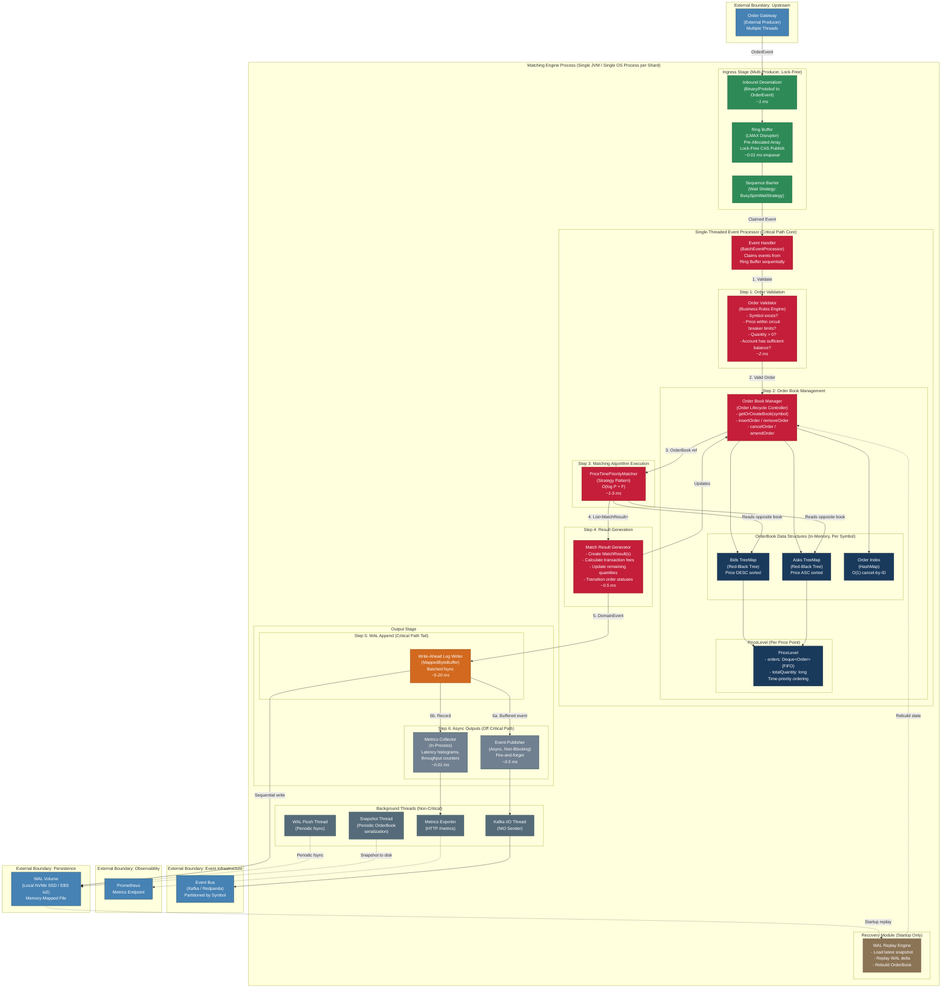

# Matching Engine -- Internal Component Detail

## Table of Contents

1. [Overview](#1-overview)
2. [Internal Component Diagram](#2-internal-component-diagram)
3. [Color Legend](#3-color-legend)
4. [Latency Budget Mapped to Sub-Components](#4-latency-budget-mapped-to-sub-components)
5. [Sub-Component Responsibilities](#5-sub-component-responsibilities)
6. [Critical Path vs. Async Classification](#6-critical-path-vs-async-classification)
7. [Architectural Commentary](#7-architectural-commentary)

---

## 1. Overview

This document zooms into the **Matching Engine (ME) process boundary** as defined in the [Initial Architecture](./initial-architecture.md). While the initial architecture describes the system-level component diagram (API Gateway, Order Gateway, ME, Event Bus, Notification Dispatcher, Analytics Service), this document provides a detailed view of the ME's internal sub-components, their interactions, data flows, threading model, and latency contributions.

The ME process is a single-threaded event processing core (one per shard) based on the LMAX Disruptor pattern. It contains the Ring Buffer ingress, Order Validator, Order Book Manager with its in-memory data structures, the Matching Algorithm, a Write-Ahead Log for durability, and async output channels for event publishing and metrics collection. Background threads handle periodic maintenance (WAL fsync, Kafka I/O, snapshots, metrics export) without interfering with the critical path.

---

## 2. Internal Component Diagram

---

## 3. Color Legend

| Color | Meaning |
|:---|:---|
| **Red** (`#c41e3a`) | Critical path components -- single-threaded, latency-sensitive, zero-lock |
| **Orange** (`#d2691e`) | Critical path tail -- WAL append is on the critical path but uses batched fsync to minimize impact |
| **Dark Blue** (`#1a3a5c`) | In-memory data structures -- the hot data that must stay in L1/L2 cache |
| **Teal/Green** (`#2e8b57`) | Ingress stage -- multi-producer, lock-free boundary between external threads and the single event processor |
| **Grey** (`#708090`) | Async/non-critical outputs -- fire-and-forget, never block the event processor thread |
| **Dark Grey** (`#556b7a`) | Background threads -- periodic maintenance that runs on separate OS threads |
| **Blue** (`#4682b4`) | External boundaries -- components outside the Matching Engine process |

---

## 4. Latency Budget Mapped to Sub-Components

The following table traces the latency budget from the [Initial Architecture (Section 2.3)](./initial-architecture.md#23-latency-budget-for-the-critical-path-matching-execution--200-ms) onto concrete sub-components within the ME process.

### 4.1 Critical Path (Single-Threaded, Sequential Execution)

| Step | Sub-Component | Latency (p99 estimate) | Notes |
|:---|:---|:---|:---|
| 1 | Inbound Deserializer | ~1.0 ms | Protobuf/binary decode |
| 2 | Ring Buffer enqueue | ~0.01 ms | Lock-free CAS, pre-allocated slot |
| 3 | Sequence Barrier wait | ~0.0 ms | BusySpin, near-zero on a loaded system |
| 4 | Order Validator | ~2.0 ms | Business rule checks |
| 5 | OrderBook insertion | ~0.05 ms | TreeMap put: O(log P) |
| 6 | PriceTimePriorityMatcher | ~1-5 ms | O(log P + F), scan + fill |
| 7 | Match Result Generator | ~0.5 ms | Fee calculation, status transitions |
| 8 | WAL Append | ~5-20 ms | Memory-mapped write, batched fsync |
| 9 | Event Publisher buffer | ~0.5 ms | Copy to local send buffer |
| 10 | Metrics Collector | ~0.01 ms | Increment counters |
| | **Total critical path (p99)** | **~30 ms** | |
| | **Headroom to 200 ms target** | **~170 ms** | Absorbs GC pauses, network transit, WAL tail latency |

### 4.2 Off Critical Path (Background Threads, Async I/O)

| Sub-Component | Thread | Notes |
|:---|:---|:---|
| WAL Flush Thread | Dedicated background thread | Periodic fsync -- does NOT block the event processor |
| Kafka I/O Thread | Dedicated background thread | NIO sender batches buffered events |
| Snapshot Thread | Dedicated background thread | Periodic OrderBook serialization for fast recovery |
| Metrics Exporter | Dedicated background thread | HTTP `/metrics` endpoint scraped by Prometheus |
| WAL Replay Engine | Main thread (startup only) | Loads snapshot + replays WAL delta to rebuild state |

---

## 5. Sub-Component Responsibilities

### 5.1 Ingress Stage

| Sub-Component | Responsibility |
|:---|:---|
| **Inbound Deserializer** | Converts the binary/Protobuf wire format from the Order Gateway into an internal `OrderEvent` object. This is the first processing step inside the ME process boundary. |
| **Ring Buffer (LMAX Disruptor)** | A pre-allocated, fixed-size circular array that serves as the lock-free boundary between multiple Order Gateway producer threads and the single event processor thread. Events are published via CAS operations (~10 ns). |
| **Sequence Barrier** | Controls event consumption. The event processor thread uses a `BusySpinWaitStrategy` to poll for new events with minimal latency (avoids OS-level thread parking). |

### 5.2 Single-Threaded Event Processor (Critical Path Core)

| Sub-Component | Responsibility |
|:---|:---|
| **Event Handler (BatchEventProcessor)** | The orchestrator. Claims events from the Ring Buffer sequentially and drives them through the processing pipeline: validate, insert, match, generate results, persist, publish. Runs on a single OS thread -- no locks, no contention. |
| **Order Validator** | Enforces business rules before an order enters the Order Book: symbol existence, price within circuit breaker limits, quantity > 0, sufficient account balance. Rejects invalid orders with an error event. |
| **Order Book Manager** | Manages the lifecycle of Order Book data structures: creates books per symbol, inserts and removes orders, handles cancel and amend operations. Tightly coupled to the Matching Engine -- same process, same thread. |
| **OrderBook (Bids TreeMap)** | A `TreeMap<Price, PriceLevel>` sorted in descending price order. `firstKey()` yields the best (highest) bid in O(1) amortized time. |
| **OrderBook (Asks TreeMap)** | A `TreeMap<Price, PriceLevel>` sorted in ascending price order. `firstKey()` yields the best (lowest) ask in O(1) amortized time. |
| **Order Index (HashMap)** | A `HashMap<OrderId, Order>` that provides O(1) cancel-by-ID lookups without traversing the tree structures. |
| **PriceLevel** | A node within the TreeMap containing a `Deque<Order>` (FIFO queue) and an aggregated `totalQuantity`. Orders at the same price are matched in arrival-time order (time priority). |
| **PriceTimePriorityMatcher** | Implements the `MatchingAlgorithm` interface (Strategy pattern). Scans the opposite side of the book, iterates price levels in best-price-first order, and fills orders FIFO within each level. Time complexity: O(log P + F) where P = price levels, F = fills. |
| **Match Result Generator** | Creates `MatchResult` objects with execution price, quantity, and transaction fees. Updates remaining quantities on matched orders and transitions their statuses (OPEN -> PARTIAL_FILL / FILLED). |

### 5.3 Output Stage

| Sub-Component | Responsibility |
|:---|:---|
| **Write-Ahead Log Writer** | Appends serialized domain events (`MatchExecuted`, `OrderPlaced`, `OrderCancelled`) to a memory-mapped file. The append itself writes to kernel page cache (~fast). Actual disk durability is handled by the background WAL Flush Thread via periodic fsync. |
| **Event Publisher** | Copies the serialized event to a local in-memory send buffer (~0.5 ms). The event processor thread never blocks on Kafka I/O. A separate Kafka I/O Thread handles actual network transmission asynchronously. |
| **Metrics Collector** | Increments in-process atomic counters and histogram buckets for latency, throughput, order book depth, and ring buffer utilization. Near-zero overhead (~0.01 ms). |

### 5.4 Background Threads

| Sub-Component | Responsibility |
|:---|:---|
| **WAL Flush Thread** | Periodically calls `fsync` on the WAL file to guarantee durability. Decoupled from the event processor so disk I/O latency spikes never block matching. |
| **Kafka I/O Thread** | NIO-based non-blocking sender that batches events from the local send buffer and transmits them to Kafka brokers. If Kafka is unavailable, events accumulate in the local buffer. |
| **Snapshot Thread** | Periodically serializes the in-memory OrderBook state to disk. Snapshots reduce WAL replay volume during crash recovery. |
| **Metrics Exporter** | Exposes an HTTP `/metrics` endpoint scraped by Prometheus at configurable intervals. |

### 5.5 Recovery Module

| Sub-Component | Responsibility |
|:---|:---|
| **WAL Replay Engine** | Executes only during startup after a crash. Loads the most recent OrderBook snapshot, then replays WAL events that occurred after the snapshot timestamp to rebuild the full in-memory state. Target recovery time: < 30 seconds. |

---

## 6. Critical Path vs. Async Classification

| Sub-Component | Path Classification | Thread | Latency Contribution |
|:---|:---|:---|:---|
| Inbound Deserializer | Critical (ingress) | Producer thread(s) | ~1 ms |
| Ring Buffer Enqueue | Critical (boundary) | Producer thread(s) | ~0.01 ms |
| Sequence Barrier | Critical (boundary) | Event processor | ~0 ms (busy spin) |
| Event Handler | Critical | Event processor | Orchestrator, no own cost |
| Order Validator | Critical | Event processor | ~2 ms |
| Order Book Manager | Critical | Event processor | ~0.05 ms |
| PriceTimePriorityMatcher | Critical | Event processor | ~1-5 ms |
| Match Result Generator | Critical | Event processor | ~0.5 ms |
| WAL Append | Critical (tail) | Event processor | ~5-20 ms |
| Event Publisher (buffer) | Async (fire-and-forget) | Event processor (copy only) | ~0.5 ms |
| Metrics Collector | Async (in-process) | Event processor | ~0.01 ms |
| WAL Flush Thread | Background | Dedicated thread | N/A (periodic) |
| Kafka I/O Thread | Background | Dedicated thread | N/A (async batches) |
| Snapshot Thread | Background | Dedicated thread | N/A (periodic) |
| Metrics Exporter | Background | Dedicated thread | N/A (HTTP scrape) |
| WAL Replay Engine | Startup only | Main thread (boot) | N/A (recovery) |

---

## 7. Architectural Commentary

### 7.1 The Thread Boundary Is the Most Important Design Decision

The single most consequential design decision visible in this diagram is the **thread boundary** between the multi-producer ingress (Ring Buffer) and the single-threaded event processor core. Everything inside the "Single-Threaded Event Processor" subgraph executes sequentially on one OS thread:

- **No locks, no mutexes, no CAS retries** within the processing core. The Order Validator, Order Book Manager, Matching Algorithm, and Result Generator all execute as plain sequential method calls. This eliminates an entire category of concurrency bugs and makes latency deterministic.
- **The Ring Buffer is the only synchronization point.** Multiple Order Gateway threads publish events into the ring buffer using lock-free CAS operations (~10 nanoseconds). The single event processor thread claims events via the Sequence Barrier. This is the only place where inter-thread coordination exists.
- **Rationale at scale.** At 83 matches/sec peak, a single thread has approximately five orders of magnitude of headroom (LMAX benchmarks at 6M+ events/sec). Introducing multi-threading within the matching core would add complexity (lock management, cache line bouncing, context switching) for zero practical benefit at this scale.

### 7.2 OrderBook Data Structures Are Co-Located for Cache Locality

The three data structures inside the OrderBook are not separate services or even separate memory regions -- they exist as plain in-process heap objects within the same thread's working set:

- **Bids TreeMap** (Red-Black Tree, descending price) -- `firstKey()` yields the best bid in O(1) amortized.
- **Asks TreeMap** (Red-Black Tree, ascending price) -- `firstKey()` yields the best ask in O(1) amortized.
- **Order Index HashMap** -- O(1) cancel-by-ID without traversing the trees.

This co-location ensures the working set remains hot in CPU L1/L2 cache during matching operations. A TreeMap insertion is O(log P) where P is the number of distinct price levels -- typically hundreds to low thousands, meaning 7-12 comparisons at most.

**Trade-off:** Pointer-based tree structures have worse cache locality than contiguous array-backed structures. If profiling later reveals cache misses as a bottleneck, a B-tree variant with higher fan-out (better spatial locality per node) could replace the Red-Black Tree without changing the external interface.

### 7.3 PriceLevel with FIFO Queue Enforces Time Priority

Each node in the TreeMap contains a `PriceLevel` holding a `Deque<Order>` -- a double-ended queue that enforces strict FIFO ordering within a single price point:

- **Price priority:** The TreeMap sorts price levels so the best price is always at the head.
- **Time priority:** Within a price level, the Deque ensures the earliest order is matched first.

The Matching Algorithm reads from the head of the Deque (`peek()` / `removeFirst()`), which is O(1). This two-level structure (sorted tree of FIFO queues) is the canonical data structure for a price-time priority order book.

### 7.4 WAL Append Is the Latency Bottleneck on the Critical Path

The WAL Writer is highlighted in orange (distinct from the red critical path components) because it is the **single largest contributor to critical path latency** at 5-20 ms. The design mitigates this through:

- **Memory-mapped file (MappedByteBuffer):** Writes go to kernel page cache, not directly to disk.
- **Batched fsync via a separate WAL Flush Thread:** The event processor appends to the memory-mapped buffer (fast) but does NOT call fsync itself.
- **Trade-off:** If the process crashes between append and fsync, the last batch of events may be lost from the WAL. This is acceptable because the event was already published to Kafka (which has its own replication), and the in-memory Order Book state is authoritative during normal operation.

The 170 ms of headroom between the ~30 ms critical path total and the 200 ms target exists precisely to absorb worst-case WAL latency spikes.

### 7.5 Async Outputs Never Block the Event Processor

- **Event Publisher** uses a local in-memory send buffer. The event processor copies the serialized event into this buffer (~0.5 ms) and immediately continues. A separate Kafka I/O Thread handles actual network transmission. If Kafka is temporarily unavailable, events accumulate locally -- the event processor is never blocked.
- **Metrics Collector** increments in-process counters (~0.01 ms). The Metrics Exporter serves these via HTTP on a separate thread.

This is the architectural mechanism that enforces the requirement from the [CLAUDE.md guidance](../../CLAUDE.md): *"Notification and Analytics services do not increase the latency of the core Matching Engine."* The decoupling happens at two levels: (1) inside the ME process, the Event Publisher buffers locally without blocking, and (2) outside the ME process, Kafka decouples the ME from all downstream consumers.

### 7.6 Recovery Module Is Startup-Only

The WAL Replay Engine executes only during startup after a crash:

1. Load the most recent OrderBook snapshot from disk (avoids full WAL replay).
2. Replay WAL events that occurred after the snapshot timestamp.
3. Rebuild the in-memory OrderBook state.
4. Begin accepting new events from the Ring Buffer.

Target recovery time: < 30 seconds. Achieved by keeping WAL segments small (frequent rotation) and taking periodic snapshots. The recovery module has zero impact on runtime latency.

### 7.7 Strategy Pattern on the Matching Algorithm

The `PriceTimePriorityMatcher` implements a `MatchingAlgorithm` interface (Strategy pattern). The single virtual dispatch cost (~nanoseconds) enables replacing the matching strategy (e.g., pro-rata allocation, volume-weighted matching) without modifying the Event Handler, Order Book Manager, or any other sub-component.

### 7.8 What Is Deliberately Excluded from the ME Process

The diagram makes explicit what is **outside** the ME process boundary:

- **Authentication and authorization** -- handled by the API Gateway and Order Gateway before events reach the Ring Buffer.
- **Protocol translation** -- the Order Gateway translates from HTTPS/WebSocket/FIX to the internal event format.
- **Rate limiting** -- enforced at the API Gateway via Redis.
- **Notification routing** -- the Notification Dispatcher (a separate process consuming from Kafka) handles Premium vs. Basic tier routing.

This separation keeps the ME focused on a single responsibility: accepting validated orders, maintaining the order book, executing matches, and persisting results.

---

*Parent document: [Initial Architecture](./initial-architecture.md)*
*Architecture style: Single-Threaded Event Processing with LMAX Disruptor Pattern*
*Primary quality attribute: Latency (< 200 ms matching, ~30 ms actual critical path)*