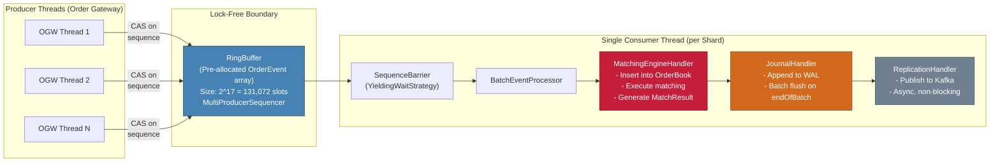

# Matching Engine -- Refined Architectural Design

## Table of Contents

1. [Purpose and Scope of This Refinement](#1-purpose-and-scope-of-this-refinement)
2. [Refinement 1: Detailed Class and Interaction Design](#2-refinement-1-detailed-class-and-interaction-design)
   - 2.1 [OrderBook Internal Data Structure Design](#21-orderbook-internal-data-structure-design)
   - 2.2 [Concurrency and Synchronization: The Disruptor Pattern](#22-concurrency-and-synchronization-the-disruptor-pattern)
     - 2.2.5 [Concurrency UML Diagram: Runtime Thread Interactions](#225-concurrency-uml-diagram-runtime-thread-interactions)
   - 2.3 [Order State Machine and MatchResult Generation](#23-order-state-machine-and-matchresult-generation)
   - 2.4 [Full Interaction Sequence: Order Lifecycle Through Match](#24-full-interaction-sequence-order-lifecycle-through-match)
   - 2.5 [Latency Rationale: Why These Structures Guarantee Sub-200ms](#25-latency-rationale-why-these-structures-guarantee-sub-200ms)
3. [Refinement 2: Streamlined Deployment View](#3-refinement-2-streamlined-deployment-view)
   - 3.1 [Topology Diagram: Logical Groups and Connectivity](#31-topology-diagram-logical-groups-and-connectivity)
   - 3.2 [Shard Anatomy: The Scaling Unit](#32-shard-anatomy-the-scaling-unit)
   - 3.3 [Hot Path vs. Cold Path Separation](#33-hot-path-vs-cold-path-separation)
   - 3.4 [Horizontal Scaling Mechanics](#34-horizontal-scaling-mechanics)
4. [Trade-Off Analysis](#4-trade-off-analysis)
5. [Risks and Mitigations Specific to These Refinements](#5-risks-and-mitigations-specific-to-these-refinements)

---

## 1. Purpose and Scope of This Refinement

The [initial architecture document](initial-architecture.md) established the foundational structure: an event-driven system with a single-threaded matching core, asset-symbol sharding, and decoupled notification/analytics services. That document answered the **"what"** and **"why"** at a macro level.

This refinement answers the **"how, precisely"** for two areas identified as insufficiently detailed:

1. **The Matching Engine Core internals.** The initial class diagram showed class names and relationships but did not reveal the internal structure of the OrderBook (how price levels are indexed, how O(log n) matching is achieved), the full Disruptor concurrency machinery (RingBuffer, SequenceBarrier, EventProcessor, WaitStrategy), or the Order state machine driving fill lifecycle management.

2. **The Deployment topology.** The initial deployment diagram enumerated individual instances (ME_A, ME_B, ME_C, Kafka Broker 1/2/3), creating visual clutter that obscured the logical groupings. This refinement replaces that with a topology-focused view that shows tiers, the pipes between them, and a single shard as a zoom-in example.

**What this document does NOT change:** The architectural decisions, concurrency model selection (single-threaded event loop), sharding strategy (asset symbol), technology choices, and latency budgets from the initial document remain in effect. This is a refinement, not a revision.

---

## 2. Refinement 1: Detailed Class and Interaction Design

### 2.1 OrderBook Internal Data Structure Design

The OrderBook is the single most performance-sensitive data structure in the system. Every matching operation reads from and writes to it. The design must support:

- **O(1) best-price lookup** -- The matching algorithm needs the best bid and best ask on every incoming order.
- **O(log P) insertion and removal by price** -- Orders arrive at arbitrary prices and must be inserted into the correct price level. P = number of distinct active price levels.
- **O(1) order lookup by ID** -- Cancel and amend operations must locate an order by its identifier without scanning the book.
- **O(1) time-priority within a price level** -- At each price level, orders are matched in FIFO order (first arrived, first filled).

The following diagram shows the granular internal structure that achieves these complexities.

#### 2.1.1 Class Diagram: OrderBook Data Structures


#### 2.1.2 Data Structure Rationale

The critical insight is the **three-way indexing** that enables all required operations at optimal complexity:

**Index 1: TreeMap by Price (bids descending, asks ascending)**

The `TreeMap<Price, PriceLevel>` provides O(log P) insertion and O(1) amortized access to the best price via `firstKey()` / `lastKey()`. The bids TreeMap uses a descending comparator so `firstKey()` returns the highest bid. The asks TreeMap uses natural (ascending) ordering so `firstKey()` returns the lowest ask.

Why TreeMap over alternatives:
- A **sorted array** would give O(1) best-price access but O(P) insertion due to shifting. P (active price levels) can be in the hundreds or low thousands for liquid assets. O(P) insertion is measurably slower for P > 50.
- A **heap / PriorityQueue** would give O(1) best-price peek and O(log P) insertion, but O(P) removal of an arbitrary price level (needed when the last order at a level is cancelled). The TreeMap provides O(log P) for all three operations.
- A **skip list** is a viable alternative with similar O(log P) expected complexity and potentially better cache locality. The TreeMap is chosen as the default because it is available in standard libraries (Java `TreeMap`, C++ `std::map`) with well-understood constant factors. A skip list can be substituted as an optimization if profiling identifies TreeMap pointer-chasing as a bottleneck.

**Index 2: DoublyLinkedList within each PriceLevel**

Orders at the same price level must be processed in FIFO order (time priority). A `DoublyLinkedList` of `OrderNode` provides:
- O(1) append to tail (new orders go to the back of the queue).
- O(1) removal from head (the first order in time is matched first).
- O(1) removal from arbitrary position (for cancel operations, since each `OrderNode` holds `prev`/`next` pointers).

Why DoublyLinkedList over a Deque or ArrayList:
- A **Deque (ArrayDeque)** provides O(1) head/tail operations but O(n) arbitrary removal. Cancel operations would require scanning the deque to find the order.
- An **ArrayList** has the same O(n) arbitrary removal problem.
- The `DoublyLinkedList` with direct node references (via the `OrderEntry`) is the only structure that supports O(1) for all three operations: append, poll-first, and remove-by-reference.

**Index 3: HashMap for O(1) Cancel/Amend by OrderId**

The `HashMap<OrderId, OrderEntry>` stores a direct pointer to each active order's `OrderEntry`, which in turn holds pointers to the `OrderNode` (for list removal) and the `PriceLevel` (for quantity bookkeeping and empty-level cleanup). This enables:

```
cancelOrder(orderId):
    entry = orderIndex.get(orderId)        // O(1) HashMap lookup
    entry.level.removeNode(entry.node)     // O(1) DoublyLinkedList removal
    entry.level.totalQuantity -= order.remainingQuantity
    if entry.level.isEmpty():
        treemap.remove(entry.level.price)  // O(log P) tree removal
    orderIndex.remove(orderId)             // O(1) HashMap removal
```

Total cancel complexity: O(log P) in the worst case (when the level becomes empty and must be removed from the TreeMap), O(1) in the common case (when other orders remain at that price level).

#### 2.1.3 Complexity Summary

| Operation | Complexity | Structure Used |
|:---|:---|:---|
| Insert order at price level | O(log P) | TreeMap insertion + LinkedList append |
| Get best bid / best ask | O(1) amortized | TreeMap.firstKey() |
| Match at best price (poll first order) | O(1) | DoublyLinkedList.pollFirst() |
| Cancel order by ID | O(1) typical, O(log P) worst | HashMap lookup + LinkedList remove + TreeMap remove if level empty |
| Get spread (best ask - best bid) | O(1) | Two firstKey() calls |
| Get depth (top N levels) | O(N) | TreeMap iterator |

Where P = number of distinct active price levels (typically 100-2,000 for liquid assets).

---

### 2.2 Concurrency and Synchronization: The Disruptor Pattern

The initial document described the single-threaded event loop conceptually. This section details the classes that implement the LMAX Disruptor pattern, showing how events flow from multiple producer threads to the single consumer thread with zero locks on the critical path.

#### 2.2.1 Class Diagram: Disruptor Infrastructure


#### 2.2.2 Disruptor Event Processing Pipeline

The Disruptor supports a **diamond dependency graph** between event handlers. This is key: the `MatchingEngineHandler`, `JournalHandler`, and `ReplicationHandler` can be arranged so that matching and journaling happen in parallel, and replication depends on both completing.

However, for our use case, the recommended configuration is a **serial pipeline** where:

1. The `MatchingEngineHandler` processes the order (insert into OrderBook, execute matching, generate results).
2. The `JournalHandler` appends the outcome to the WAL.
3. The `ReplicationHandler` publishes the event to the message broker.

Each handler runs on the **same single thread** via the `BatchEventProcessor`, processing events in sequence numbers. The `endOfBatch` flag on each event enables batch-aware optimizations (e.g., the JournalHandler can batch-flush the WAL at the end of each batch rather than per-event).



#### 2.2.3 WaitStrategy Selection

The `WaitStrategy` determines how the consumer thread waits for new events when the ring buffer is empty. This choice directly impacts latency vs. CPU utilization.

| Strategy | Mechanism | Latency (event available) | CPU Usage (idle) | Recommended For |
|:---|:---|:---|:---|:---|
| `BusySpinWaitStrategy` | Tight spin loop on sequence value | Lowest (~nanoseconds) | 100% of one core always | Ultra-low-latency (financial exchanges) where dedicated cores are available |
| `YieldingWaitStrategy` | Spin for N iterations, then `Thread.yield()` | Very low (~microseconds) | High but yields to OS | **Selected for this system.** Good latency with reasonable CPU usage. Suitable for our throughput where idle periods are common. |
| `BlockingWaitStrategy` | `ReentrantLock` + `Condition.await()` | Higher (~10-100 microseconds) | Near zero when idle | Throughput-oriented systems where latency is not critical |

**Decision:** `YieldingWaitStrategy`. At 83 matches/sec peak, the consumer thread will be idle most of the time. `BusySpinWaitStrategy` would waste an entire CPU core to save nanoseconds on a workload that has 170 ms of headroom. `YieldingWaitStrategy` provides microsecond-level wake-up latency while yielding the CPU during idle periods.

#### 2.2.4 Ring Buffer Sizing

The ring buffer size must be a power of 2 (Disruptor requirement for bitmask-based index calculation). The size determines how many events can be buffered between producers and the consumer before back-pressure is applied.

```
Peak ingest rate:  ~109 orders/sec (42 sell + 67 buy)
Consumer processing time per event:  ~10-50 microseconds
Consumer throughput:  ~20,000-100,000 events/sec

Buffer size calculation:
  At peak, producer rate (109/sec) is far below consumer capacity (20,000+/sec).
  Even with a 1-second consumer stall, only ~109 events accumulate.
  Ring buffer size of 2^17 = 131,072 provides >1,000 seconds of buffering at peak rate.
```

A ring buffer of **131,072 slots** (2^17) is chosen. This is generous and ensures that transient consumer stalls (e.g., a long GC pause of several seconds) do not cause producer back-pressure. Each `OrderEvent` is pre-allocated in the ring buffer at startup, eliminating per-event allocation and reducing GC pressure.

#### 2.2.5 Concurrency UML Diagram: Runtime Thread Interactions

The class diagram in section 2.2.1 shows the static structure of the Disruptor components. The pipeline diagram in section 2.2.2 shows the logical flow. This section complements both by showing the **runtime concurrency behavior**: which threads exist, how they interact through shared objects, where synchronization occurs, and why the single-writer principle eliminates locks from the matching critical path.

##### Thread-to-Component Mapping

The following table defines each thread in a single matching shard, its responsibility, and the objects it accesses.

| Thread | Affinity | Responsibility | Objects Written | Objects Read | Synchronization |
|:---|:---|:---|:---|:---|:---|
| **OGW Thread 1..N** (Producer) | Order Gateway pod, routed via network | Translate inbound order requests into `OrderEvent` slots in the RingBuffer | `RingBuffer.entries[seq]` (claim + write), `MultiProducerSequencer.cursor` (CAS publish) | `MultiProducerSequencer.gatingSequence` (to check available capacity) | CAS on sequence counter only. No locks. Producers contend only with each other, never with the consumer. |
| **Matching Thread** (Consumer) | Matching Shard pod, pinned to dedicated CPU core | Run the `BatchEventProcessor` loop: pull events from the RingBuffer, invoke the serial handler chain (Match -> Journal -> Replicate) | `OrderBook` (all fields), `WriteAheadLog` (append buffer), `KafkaProducer` internal buffer (enqueue), `BatchEventProcessor.sequence` (advance) | `RingBuffer.entries[seq]` (read event data), `SequenceBarrier.cursorSequence` (poll for new events) | **None.** Single-writer principle: this is the only thread that reads/writes the OrderBook, the WAL append buffer, and its own sequence. No locks, no CAS, no volatile writes on the critical path (except the sequence advance after processing). |
| **Kafka I/O Thread** (Background) | Matching Shard pod, managed by KafkaProducer | Drain the producer's `RecordAccumulator` buffer, batch records, compress, and send to Kafka brokers over the network | Network socket buffers, `RecordAccumulator` (drain batches) | `RecordAccumulator` (read pending batches) | Internal to KafkaProducer: lock-free handoff from Matching Thread to I/O Thread via the `RecordAccumulator`'s thread-safe append. Completely off the critical path. |
| **WAL Fsync Thread** (Background, optional) | Matching Shard pod | Periodically `fsync` the memory-mapped WAL file to guarantee durability | OS page cache -> disk flush | WAL file descriptor | Decoupled from the Matching Thread. The Matching Thread does `mmap` writes (memory-speed). The fsync thread calls `msync`/`fsync` on a timer or on `endOfBatch` signal. No contention with the Matching Thread since `mmap` writes and `fsync` operate on different levels (virtual memory vs. disk flush). |

##### Sequence Diagram: Runtime Thread Interactions

The following UML sequence diagram shows a single order event flowing through the system, with explicit thread boundaries (represented by the `par`/`loop` fragments) and synchronization points (CAS, SequenceBarrier polling). The critical observation is that the entire right-hand side of the diagram (the Matching Thread's processing) involves **zero synchronization primitives** -- no locks, no CAS, no memory barriers beyond the single volatile sequence read/write.


##### Concurrent Object Access Map

The diagram below provides an alternative view of the same concurrency model, focused on **which threads access which objects** and the isolation mechanisms that prevent data races. This makes the single-writer principle explicit at the object level.

```
+------------------------------------------------------------------+
|                    OBJECT ACCESS MAP                              |
|------------------------------------------------------------------|
|                                                                  |
|  SHARED OBJECTS           WRITER(S)          READER(S)           |
|  ===============          =========          =========           |
|                                                                  |
|  RingBuffer.entries[]     OGW Threads        Matching Thread     |
|    Sync: sequence-based coordination (producers write slot       |
|    BEFORE publishing sequence; consumer reads slot AFTER         |
|    observing published sequence -- happens-before guarantee)     |
|                                                                  |
|  MultiProducer-           OGW Threads        OGW Threads         |
|    Sequencer.cursor       (CAS to claim)     (CAS to claim)     |
|    Sync: CAS (compare-and-swap). Only producer-vs-producer       |
|    contention. Consumer never touches this.                      |
|                                                                  |
|  SequenceBarrier          Sequencer          Matching Thread     |
|    .cursorSequence        (volatile write)   (volatile read)     |
|    Sync: single volatile variable. No lock.                      |
|                                                                  |
+------------------------------------------------------------------+
|                                                                  |
|  THREAD-LOCAL OBJECTS     SOLE OWNER         ACCESSED BY         |
|  ====================     ==========         ===========         |
|                                                                  |
|  OrderBook                Matching Thread    Matching Thread     |
|    (TreeMap, LinkedList,  ONLY               ONLY                |
|     HashMap -- all        No sync needed.    No sync needed.     |
|     internal fields)      Single-writer      Single-reader.      |
|                           principle.                             |
|                                                                  |
|  WAL Append Buffer        Matching Thread    Matching Thread     |
|    (mmap region)          (write via mmap)   (not read on        |
|                                               critical path)    |
|    Note: FST reads pages for fsync, but operates on OS           |
|    page cache level -- no application-level data race.           |
|                                                                  |
|  MatchResultCollector     Matching Thread    Matching Thread     |
|                           ONLY               ONLY                |
|                           No sync needed.    No sync needed.     |
|                                                                  |
|  BatchEventProcessor      Matching Thread    (Sequence value     |
|    .sequence              (advances after    read by producers   |
|                            each batch)       to check gating --  |
|                                              single volatile)    |
|                                                                  |
|  KafkaProducer            Matching Thread    Kafka I/O Thread    |
|    .RecordAccumulator     (append records)   (drain batches)     |
|    Sync: internal lock-free queue inside KafkaProducer.          |
|    Matching Thread cost: ~1-5 microseconds (enqueue only).       |
|                                                                  |
+------------------------------------------------------------------+
```

##### Design Rationale: Why This Concurrency Model Keeps Matching Under 200ms

**1. The Disruptor pattern eliminates lock contention entirely from the matching critical path.**

In a traditional multi-threaded matching engine, the OrderBook would be protected by a `ReadWriteLock` or `synchronized` block. Under contention -- which is the norm when multiple gateway threads submit orders simultaneously -- lock acquisition adds 20-50 ns under low contention but can spike to 10-100 microseconds under high contention due to lock convoys, thread parking/unparking, and OS scheduler involvement. Worse, p99 latency becomes unpredictable because a thread holding the lock may be preempted by the OS, causing all waiting threads to stall.

The Disruptor eliminates this entirely by separating the **claiming of a slot** (producers, via CAS on the sequence counter) from the **processing of events** (single consumer thread). Producers never touch the OrderBook. The consumer never contends for the sequence counter. The two concerns are mediated by the RingBuffer and SequenceBarrier, which use only volatile reads/writes and CAS -- no OS-level locks.

**Result:** The matching critical path (MatchingEngineHandler accessing OrderBook data structures) executes with **zero synchronization overhead**. No locks, no CAS, no memory barriers beyond a single volatile read of the cursor sequence at the start of each batch and a single volatile write of the consumer sequence at the end.

**2. The single-writer principle preserves CPU cache coherence.**

When multiple threads write to the same data, CPU cache coherence protocols (MESI/MOESI) force cache-line invalidations between cores. Each invalidation costs 20-80 ns depending on whether the line is in L2 (same socket) or L3/remote (cross-socket). For a hot data structure like the OrderBook that is written on every event, these invalidations would dominate the processing time.

With the single-writer model, the OrderBook's working set (TreeMap nodes, LinkedList pointers, HashMap buckets) stays warm in the Matching Thread's L1/L2 cache. No other thread writes to these cache lines, so no invalidations occur. The entire matching operation -- TreeMap traversal, LinkedList manipulation, HashMap lookup -- executes against L1/L2 cache with ~1-4 ns access times rather than ~20-80 ns per cache miss.

**Result:** At typical order book depth (100-500 price levels, 1,000-10,000 active orders), the entire working set fits in L2 cache (~256 KB - 1 MB). Matching a single order against the book completes in **~10-50 microseconds**, dominated by application logic rather than memory access.

**3. Batch processing amortizes the only remaining synchronization cost.**

The `BatchEventProcessor` reads the cursor sequence (volatile read) once per batch, not once per event. If 10 events arrive in quick succession, the barrier returns all 10 in a single `waitFor()` call, and the handler chain processes them sequentially without re-checking the barrier. The consumer's sequence is advanced once after the entire batch is processed (a single volatile write).

This means the **per-event synchronization cost is amortized to near zero** during bursts. At peak load (83 events/sec), even small batches of 2-5 events reduce the already negligible barrier overhead by 2-5x.

**4. Background I/O is fully decoupled from the critical path.**

The two most expensive I/O operations -- WAL fsync (~5-20 ms) and Kafka network send (~2-10 ms) -- execute on dedicated background threads. The Matching Thread interacts with them only through memory-speed operations:

- WAL: `mmap` write (~100-500 ns). The OS handles the actual disk write asynchronously via the page cache. The background fsync thread ensures durability without blocking the Matching Thread.
- Kafka: `KafkaProducer.send()` enqueues to an in-memory buffer (~1-5 microseconds). The Kafka I/O thread handles network transmission asynchronously.

**Result:** The Matching Thread's critical path latency is bounded by in-memory computation (~50-100 microseconds per event) plus memory-speed I/O (~1-6 microseconds), totaling approximately **~60-110 microseconds per event**. With WAL fsync amortized across batches (~2 ms per batch), the worst-case end-to-end latency per event is approximately **~3.1 ms** -- a factor of **~65x below the 200 ms target**. This headroom absorbs GC pauses (up to ~10 ms with ZGC), network jitter (~0.5 ms), OS scheduling delays (~1 ms), and deep-fill matching scenarios (~50 microseconds for 100+ fills) without approaching the budget.

---

### 2.3 Order State Machine and MatchResult Generation

#### 2.3.1 Order State Transitions

The `Order` object follows a strict state machine. State transitions are enforced within the single-threaded event processor, so no concurrent access is possible and no synchronization is needed.


#### 2.3.2 State Transition Event Mapping

Each state transition produces a domain event that is published to the event bus:

| Transition | Domain Event | Published To | Critical Path? |
|:---|:---|:---|:---|
| `[*] -> NEW` | `OrderPlaced` | Event Bus (async) | No (publish is fire-and-forget) |
| `NEW -> PARTIALLY_FILLED` | `OrderPartiallyFilled` | Event Bus (async) | No |
| `NEW -> FILLED` | `OrderFilled` | Event Bus (async) | No |
| `PARTIALLY_FILLED -> PARTIALLY_FILLED` | `OrderPartiallyFilled` | Event Bus (async) | No |
| `PARTIALLY_FILLED -> FILLED` | `OrderFilled` | Event Bus (async) | No |
| `NEW -> CANCELLED` | `OrderCancelled` | Event Bus (async) | No |
| `PARTIALLY_FILLED -> CANCELLED` | `OrderCancelled` | Event Bus (async) | No |
| `NEW -> REJECTED` | `OrderRejected` | Event Bus (async) | No |
| Match produced | `MatchExecuted` | Event Bus (async) | No |

All event publishing is asynchronous and off the critical path. The `MatchingEngineHandler` produces these events as side effects of processing, and the `ReplicationHandler` publishes them in batch.

#### 2.3.3 MatchResult Generation: Class Detail


**Maker/Taker model:** The `FeeCalculator` distinguishes between:
- **Maker** (the resting order that was already in the book, providing liquidity): Lower fee.
- **Taker** (the incoming order that triggered the match, removing liquidity): Higher fee.

This supports the Transaction Fees revenue model from the business requirements and is the standard maker-taker fee structure used by most exchanges.

---

### 2.4 Full Interaction Sequence: Order Lifecycle Through Match

This sequence diagram traces a buy order from submission through partial fill, showing all internal class interactions and state transitions.


---

### 2.5 Latency Rationale: Why These Structures Guarantee Sub-200ms

The following table maps each design choice to its latency contribution and explains why the 200 ms budget is met with substantial headroom.

| Design Element | Latency Contribution | Why It Matters |
|:---|:---|:---|
| **TreeMap for price levels** | O(log P) where P ~ 100-2,000. At P=2,000, log2(P) ~ 11 comparisons. Each comparison is a long integer compare (~1 ns). Total: **~50-100 nanoseconds** including pointer traversal. | A sorted array insertion would cost O(P) shifting = ~2,000 memory moves. A hash map would not maintain sorted order for best-price lookup. The TreeMap provides the optimal balance. |
| **DoublyLinkedList for time priority** | O(1) for all operations (append, poll-first, remove-by-reference). Each operation is 2-3 pointer assignments. Total: **~5-10 nanoseconds**. | An ArrayList remove would shift O(n) elements. A singly-linked list would require O(n) traversal for remove-by-reference. The doubly-linked list with direct node references eliminates scanning. |
| **HashMap for order index** | O(1) amortized lookup by OrderId. With a well-distributed hash (OrderId is a monotonic long), expect zero collisions. Total: **~10-20 nanoseconds**. | Without this index, cancel operations would require scanning the entire book: O(P * L) where L = orders per level. At scale, this could be milliseconds. The HashMap makes cancels constant-time. |
| **Pre-allocated RingBuffer** | Zero heap allocation on the critical path. Events are written into pre-existing slots via `copyFrom()`. No GC pressure from event processing. Total allocation cost: **0 nanoseconds**. | Object allocation in Java costs ~10-20 ns per object and creates GC pressure. At 83 events/sec this is negligible individually, but GC pauses from accumulated garbage can cause unpredictable latency spikes at p99. Pre-allocation eliminates this risk entirely. |
| **YieldingWaitStrategy** | Consumer wakes within **~1-10 microseconds** of event publication. Spin phase detects the new sequence value within CPU cache coherence latency. | BlockingWaitStrategy would add ~10-100 microseconds of kernel scheduling latency per wake-up. BusySpinWaitStrategy would save ~1 microsecond but waste an entire CPU core. |
| **Single-threaded processing** | Zero lock acquisition, zero CAS retry, zero context switch, zero cache-line invalidation. The entire OrderBook working set stays hot in L1/L2 cache. Total synchronization overhead: **0 nanoseconds**. | A ReadWriteLock would add ~20-50 ns per lock/unlock under no contention, but under contention (which is the norm for write-heavy matching), lock convoys cause p99 spikes of 100x+ the median. |
| **Batch WAL flush** | Per-event WAL append is a memory-mapped write: **~100-500 nanoseconds**. The `fsync` is deferred to `endOfBatch`, costing **~5-20 ms** amortized across the batch. | Immediate `fsync` per event would add 5-20 ms to EVERY event. Batch flushing amortizes this across all events in a batch. At 83 events/sec with batches of ~10 events, the per-event fsync cost is ~0.5-2 ms. |
| **Async Kafka publish** | The `ReplicationHandler` calls `KafkaProducer.send()` which is non-blocking (returns a Future). The producer batches and sends in a background I/O thread. Total critical-path cost: **~1-5 microseconds** (enqueue to local buffer). | A synchronous Kafka produce would add ~2-10 ms of network round-trip per event. The async model moves this entirely off the critical path. |

**Aggregate worst-case critical path latency:**

```
TreeMap operations:      ~0.1 microseconds
LinkedList operations:   ~0.01 microseconds
HashMap lookups:         ~0.02 microseconds
Fee calculation:         ~0.5 microseconds
WAL append (mmap):       ~0.5 microseconds
Kafka enqueue (async):   ~5 microseconds
WaitStrategy wake-up:    ~10 microseconds
Application logic:       ~50 microseconds
-------------------------------------------
Total per-event:         ~66 microseconds  (0.066 ms)

WAL batch fsync (amortized): ~2 ms
Deserialization:             ~1 ms
-------------------------------------------
Total critical path:         ~3.1 ms
```

This is **~65x below the 200 ms target**. The headroom absorbs:
- GC pauses (up to ~10 ms with ZGC/Shenandoah)
- Network transit from Order Gateway to ME (up to ~0.5 ms intra-cluster)
- Occasional long-running matches with deep fills (up to ~50 microseconds for 100+ fills)
- Kernel scheduling jitter (up to ~1 ms)

Even stacking all pessimistic scenarios simultaneously, the total remains well under 50 ms.

---

## 3. Refinement 2: Streamlined Deployment View

### 3.1 Topology Diagram: Logical Groups and Connectivity

This diagram replaces the instance-level deployment view from the initial document. It shows **logical tiers** with their scaling characteristics and the **pipes** (protocols, brokers, storage) between them. Individual instances are not shown; instead, the multiplicity is indicated by annotations.


**Reading guide:**
- **Red nodes** = Latency-critical (Hot Path). Every millisecond counts here.
- **Blue nodes** = Event infrastructure (the bridge between Hot and Cold).
- **Gray nodes** = Throughput-oriented (Cold Path). Latency is relaxed; throughput and correctness matter.
- **Green nodes** = Persistent storage. Differentiated by access pattern (sequential write vs. analytical query vs. archive).
- **Solid arrows** = Synchronous or on the critical data path.
- **Dashed arrows** = Asynchronous, background, or non-critical.
- **Bold red arrows** = The innermost Hot Path (Order Gateway to Shard to WAL to Broker).

### 3.2 Shard Anatomy: The Scaling Unit

Rather than repeating the shard structure N times, this section provides a detailed view of a **single shard** -- the atomic unit of horizontal scaling. To add capacity, deploy another instance of this unit and assign symbols to it via the consistent hash ring.


**Scaling is horizontal replication of this unit.** To go from 3 shards to 4:

1. Provision a new pod with an identical configuration (RingBuffer, handlers, WAL volume).
2. Update the consistent hash ring in the coordination service (etcd/ZooKeeper) to assign a subset of symbols to the new shard.
3. For the migrating symbols: pause order acceptance (~seconds), replay the WAL segment for those symbols on the new shard to reconstruct the OrderBook, resume order acceptance.
4. The Order Gateway refreshes its routing table and begins sending orders for migrated symbols to the new shard.

No changes to the shard's internal code or configuration. The shard is symbol-agnostic; it processes whatever OrderBooks are assigned to it.

### 3.3 Hot Path vs. Cold Path Separation

This is the fundamental architectural boundary that enables the latency guarantees. The diagram below makes this separation explicit.


**Key properties of this separation:**

1. **The Hot Path has zero dependencies on the Cold Path.** If the Notification Dispatcher crashes, the Analytics Service is overloaded, or the OLAP database is down, the Matching Engine continues processing orders with unchanged latency. The Kafka producer operates in fire-and-forget mode with a local buffer; if the broker is temporarily unreachable, events accumulate in-process and are flushed when connectivity restores.

2. **The Bridge (Kafka async produce) is the only coupling point.** It is designed to be non-blocking from the Hot Path's perspective. The `KafkaProducer.send()` call enqueues a record to an in-memory buffer and returns immediately. A background sender thread handles batching, compression, and network I/O.

3. **The Cold Path scales independently.** Notification Dispatchers and Analytics Services are stateless Kafka consumers that can be horizontally scaled via HPA based on consumer lag. Scaling the Cold Path requires no changes to the Hot Path.

4. **Failure isolation is complete.** A slow consumer on the Cold Path causes Kafka consumer lag to increase but does not exert back-pressure on the producer (the ME). Kafka's retention policy ensures events are not lost during consumer downtime (default retention: 7 days).

### 3.4 Horizontal Scaling Mechanics

The following table summarizes how each tier scales and the operational effort required.

| Tier | Scaling Model | Trigger | Effort | Impact on Hot Path |
|:---|:---|:---|:---|:---|
| **Load Balancer** | Vertical (upgrade instance type) or managed service scaling | Connection count, bandwidth | None (managed) | None |
| **API Gateway** | Horizontal (HPA) | CPU > 60%, request rate | Automatic | None (stateless) |
| **Order Gateway** | Horizontal (HPA) | CPU > 60%, queue depth | Automatic | None (stateless, routes by hash) |
| **Matching Shards** | Horizontal (add shard) | Per-shard throughput approaching capacity, hot-symbol detection | **Manual, planned operation**. Requires symbol rebalancing and WAL replay. | Brief pause (~seconds) for migrating symbols only. Other symbols unaffected. |
| **Message Broker** | Horizontal (add broker + rebalance partitions) | Broker I/O saturation, partition lag | Semi-automatic (Kafka partition reassignment) | None (async publish) |
| **Notification Dispatcher** | Horizontal (HPA) | Kafka consumer lag > threshold | Automatic | None (Cold Path) |
| **Analytics Service** | Horizontal (HPA) | Kafka consumer lag, CPU | Automatic | None (Cold Path) |
| **OLAP Database** | Vertical or sharded | Query latency, storage capacity | Manual | None (Cold Path) |

---

## 4. Trade-Off Analysis

### 4.1 Trade-Offs in Data Structure Design

| Trade-Off | Decision | Justification |
|:---|:---|:---|
| **TreeMap vs. Skip List for price levels** | TreeMap as default; Skip List as profiling-driven optimization | TreeMap is available in standard libraries with well-understood behavior. Skip List may offer better cache locality but requires a custom implementation and careful benchmarking. At our scale (~100 microsecond matching), the difference is in the nanoseconds -- not worth the complexity unless profiling reveals pointer-chasing as a bottleneck. |
| **DoublyLinkedList vs. ArrayDeque for time priority** | DoublyLinkedList with direct node references | ArrayDeque provides better cache locality for iteration but O(n) for remove-by-reference. Cancel operations are frequent (estimated 10-30% of all order operations in active markets). O(n) cancel at 200+ orders per price level is measurably slower than O(1) direct-node removal. |
| **Three-way indexing memory overhead vs. operation speed** | Accept the memory overhead of the HashMap index and node pointers | Each active order consumes ~3 additional pointers (OrderEntry -> OrderNode, OrderEntry -> PriceLevel, OrderEntry -> Order) = ~24 bytes extra on a 64-bit system. For 100,000 active orders, this is ~2.4 MB. Negligible compared to the GB of heap available, and it eliminates O(n) scans for cancel operations. |
| **Pre-allocated vs. dynamically allocated events** | Pre-allocated RingBuffer with object reuse | Eliminates per-event GC pressure. The cost is a fixed memory footprint at startup (131,072 OrderEvent objects ~= 10-20 MB). This is insignificant and provides deterministic latency by removing GC from the critical path. |

### 4.2 Trade-Offs in Concurrency Design

| Trade-Off | Decision | Justification |
|:---|:---|:---|
| **YieldingWait vs. BusySpinWait** | YieldingWaitStrategy | BusySpin saves ~1-5 microseconds of wake-up latency but wastes a full CPU core 24/7. At 83 events/sec peak, the consumer is idle >99.99% of the time. Dedicating a core to spin during idle periods is an unjustifiable resource waste at this scale. Yielding provides sub-10 microsecond wake-up, which is 20,000x below the 200 ms budget. |
| **Serial handler chain vs. diamond/parallel handlers** | Serial: Match -> Journal -> Replicate | Parallel handlers (Match and Journal running concurrently) would require multi-threaded access to the event's data, breaking the single-writer principle. The serial chain keeps all processing on one thread, ensuring the OrderBook is never accessed concurrently. The total handler chain time (~100 microseconds) is so far below budget that parallelizing would add complexity for zero practical benefit. |
| **Single large RingBuffer vs. per-symbol RingBuffer** | Single RingBuffer per shard, shared across all symbols assigned to that shard | A per-symbol RingBuffer would reduce contention between symbols but would require per-symbol consumer threads, negating the single-threaded model's simplicity. Since a shard handles a bounded set of symbols and the total throughput is low, a single RingBuffer is sufficient. |

### 4.3 Trade-Offs in Deployment Design

| Trade-Off | Decision | Justification |
|:---|:---|:---|
| **Topology simplicity vs. instance-level visibility** | Topology-level deployment view (this refinement) with a single shard zoom-in | Instance-level diagrams become cluttered and repetitive as shard count grows. The topology view communicates the architectural intent (which tiers exist, how they connect, which scale independently) more effectively. Instance-level details are captured in operational runbooks and Kubernetes manifests, not in the architecture diagram. |
| **Hot/Cold path separation vs. unified processing** | Strict separation via async event bus | A unified model (where matching, notification, and analytics happen in one pipeline) would simplify deployment but would make the Cold Path a latency contributor on the Hot Path. Any slowdown in analytics (e.g., OLAP write latency spike) would directly degrade matching latency. The event bus adds operational overhead (Kafka cluster management) but provides absolute latency isolation. |
| **Manual shard scaling vs. automated rebalancing** | Manual, planned shard addition | Automated rebalancing (detecting hot shards and migrating symbols without human intervention) is a significant engineering investment: automated WAL replay, zero-downtime symbol migration, state consistency verification. At 3-4 shards with well-characterized load patterns, manual scaling via runbook is operationally simple and avoids the risk of automated rebalancing bugs corrupting order state. |

---

## 5. Risks and Mitigations Specific to These Refinements

| # | Risk | Likelihood | Impact | Mitigation |
|:---|:---|:---|:---|:---|
| 1 | **TreeMap pointer-chasing causes cache misses under deep order books** (thousands of price levels) | Low | Low | Profile under realistic order book depth. If cache misses are measurable, substitute a B-tree or skip list with better locality. At typical depth (100-500 levels), TreeMap nodes fit in L2 cache. |
| 2 | **HashMap resizing causes latency spike** when order count crosses a rehash threshold | Low | Medium | Pre-size the HashMap to expected order count (e.g., initial capacity = 100,000 with load factor 0.75 avoids rehashing until 75,000 orders). Monitor order count per shard. |
| 3 | **RingBuffer overflow under extreme burst** (producers faster than consumer for extended period) | Very Low | High | At 131,072 slots and ~109 events/sec peak ingest, overflow requires the consumer to stall for >20 minutes. Monitor ring buffer utilization. Alert at 50% capacity. If the consumer stalls that long, it indicates a crash requiring restart, not a capacity issue. |
| 4 | **WAL batch fsync loses events on crash** (events written to mmap but not fsynced) | Low | Medium | The maximum data loss window equals the batch interval (e.g., last 10 events or last 50 ms of events). These can be recovered from the Kafka event log, which has its own replication. Acceptable trade-off for reduced fsync overhead. |
| 5 | **DoublyLinkedList memory fragmentation** over long running periods (repeated allocate/free of OrderNode) | Low | Low | Use an object pool for OrderNode allocation. Pre-allocate a pool of 100,000 nodes. When an order is removed, return its node to the pool. Eliminates fragmentation and GC pressure from node allocation. |
| 6 | **Kafka producer buffer grows unboundedly** if broker is unreachable for extended period | Low | Medium | Configure `buffer.memory` limit on the Kafka producer (e.g., 64 MB). When the buffer is full, `send()` blocks or throws based on `max.block.ms`. The ReplicationHandler must handle this gracefully: log the failure, increment an error counter, and continue processing (do not block the matching thread). Events are recoverable from the WAL. |

---

*Document version: 2.0 (Refinement of initial architecture)*
*Builds on: [initial-architecture.md](initial-architecture.md)*
*Refinement focus: (1) Detailed class and data structure design for OrderBook, Disruptor, and Order state machine. (2) Streamlined deployment topology with Hot/Cold path separation.*
*Primary quality attributes: Latency (< 200 ms matching, demonstrated at ~3 ms worst-case) and Horizontal Scalability (shard-based, linear scaling)*