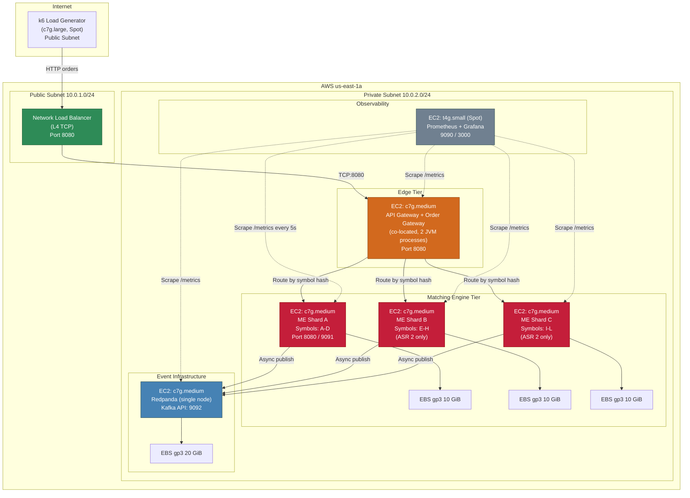

# Cloud Experiment: AWS Deployment for ASR Validation

## Table of Contents

1. [Overview](#1-overview)
2. [Component-to-AWS-Service Mapping](#2-component-to-aws-service-mapping)
3. [Instance Types and Specifications](#3-instance-types-and-specifications)
4. [Networking Setup](#4-networking-setup)
5. [Cost Estimation](#5-cost-estimation)
6. [Deployment Topology Diagram](#6-deployment-topology-diagram)
7. [Step-by-Step Deployment Guide](#7-step-by-step-deployment-guide)
8. [Cost Optimization Tips](#8-cost-optimization-tips)
9. [Service Comparison](#9-service-comparison)

---

## 1. Overview

This document defines a minimal, lowest-cost AWS deployment for running the architectural experiment to validate both ASRs:

- **ASR 1 (Latency):** Matching execution < 200 ms (p99) at 1,000 matches/min.
- **ASR 2 (Scalability):** Scale from 1,000 to 5,000 matches/min via asset-symbol sharding.

The deployment restores the **edge layer** (Load Balancer, API Gateway, Order Gateway) to validate the full critical path latency, while excluding cold-path components (Notification Dispatcher, Analytics, Event Store, ClickHouse, Redis).

**Key cost-saving decisions:**
- Co-locate API Gateway and Order Gateway on a single instance.
- Self-managed Redpanda on EC2 instead of Amazon MSK (saves ~$170/month).
- Self-managed Prometheus + Grafana instead of AMP/AMG (saves ~$50-100/month).
- Graviton (ARM64) instances throughout for 20% cost savings over x86.
- Spot instances for non-critical components (load generator, monitoring).

---

## 2. Component-to-AWS-Service Mapping

| Architecture Component | AWS Service | Justification |
|:---|:---|:---|
| **L4 Load Balancer** | Network Load Balancer (NLB) | L4 TCP passthrough for lowest latency (<100 us). No per-request content inspection needed. |
| **API Gateway (custom)** | EC2 instance (shared) | Lightweight stateless HTTP proxy. Shares an instance with Order Gateway to cut cost. |
| **Order Gateway** | EC2 instance (shared with API GW) | Stateless. Symbol-hash routing to ME shards. Co-located with API GW on same instance. |
| **Matching Engine Shards** | Dedicated EC2 instances | Stateful, latency-critical. Needs dedicated CPU for single-threaded event processing. |
| **Message Broker** | EC2 (self-managed Redpanda) | Single-node Redpanda. Far cheaper than MSK. Kafka-API compatible. |
| **Monitoring** | EC2 (self-hosted Prometheus + Grafana) | Self-hosted on a single small instance. CloudWatch cannot capture custom ME histograms at 5s scrape intervals. |
| **Load Generator** | EC2 instance (k6) | Runs k6 with constant-arrival-rate executor. |
| **WAL Storage** | EBS gp3 volumes | 3,000 baseline IOPS free. Sufficient for WAL sequential writes. |
| **Redis** | **EXCLUDED** | Not on the matching critical path. |
| **Notification/Analytics/Event Store** | **EXCLUDED** | Cold-path consumers. Not relevant to ASR validation. |

---

## 3. Instance Types and Specifications

### 3.1 Instance Roster

| Component | Instance Type | vCPU | RAM | Storage | Pricing Model | $/hr | Count |
|:---|:---|:---|:---|:---|:---|:---|:---|
| API GW + Order GW | c7g.medium | 1 | 2 GiB | 8 GiB gp3 | On-demand | $0.0289 | 1 |
| ME Shard A | c7g.medium | 1 | 2 GiB | 18 GiB gp3 | On-demand | $0.0289 | 1 |
| ME Shard B | c7g.medium | 1 | 2 GiB | 18 GiB gp3 | On-demand | $0.0289 | 1 (ASR 2 only) |
| ME Shard C | c7g.medium | 1 | 2 GiB | 18 GiB gp3 | On-demand | $0.0289 | 1 (ASR 2 only) |
| Redpanda | c7g.medium | 1 | 2 GiB | 20 GiB gp3 | On-demand | $0.0289 | 1 |
| Monitoring | t4g.small | 2 (burst) | 2 GiB | 20 GiB gp3 | Spot | $0.0050 | 1 |
| k6 Load Gen | c7g.large | 2 | 4 GiB | 8 GiB gp3 | Spot | $0.0200 | 1 |
| NLB | -- | -- | -- | -- | Fixed | $0.0225 | 1 |

### 3.2 Why c7g (Graviton3) for the ME

| Factor | Value |
|:---|:---|
| **Processor** | AWS Graviton3 (Arm Neoverse V1), 2.6 GHz |
| **Single-thread IPC** | Comparable to c6i (Intel), 15% cheaper |
| **L2 cache per core** | 1 MiB (benefits TreeMap traversals) |
| **Java compatibility** | Java 21 has native ARM64 (AArch64) support via Temurin/Corretto |
| **Cost vs. x86** | c7g.medium: $0.0289/hr vs c6i.medium: $0.0340/hr (15% savings) |
| **Enhanced networking** | ENA enabled by default |

### 3.3 Why Not t4g (Burstable) for the ME

T4g uses CPU credits. Under sustained load (5-minute and 30-minute tests), credits deplete and performance drops to baseline (20% of a core for t4g.medium). The ME needs sustained, predictable single-core performance for latency validation. Compute-optimized (c7g) guarantees this.

### 3.4 Why Not c7g.large (2 vCPU) for the ME

The matching engine is single-threaded. The second vCPU would only serve background threads (WAL flush, Kafka I/O, metrics export) which are trivially lightweight. At 83 matches/sec peak, a single core has 5+ orders of magnitude headroom.

### 3.5 EBS gp3 Specifications

| Spec | Value |
|:---|:---|
| Baseline IOPS | 3,000 (free, included) |
| Baseline throughput | 125 MiB/s (free, included) |
| Cost | $0.064/GiB-month |

---

## 4. Networking Setup

### 4.1 VPC Configuration

```
VPC CIDR: 10.0.0.0/16

Subnets (single AZ: us-east-1a):
  - Public Subnet:  10.0.1.0/24  (NLB, load generator)
  - Private Subnet: 10.0.2.0/24  (API GW, Order GW, ME shards, Redpanda, Monitoring)
```

**Single AZ rationale:** Cross-AZ traffic adds 0.5-1.5 ms of latency and costs $0.01/GB. For an experiment validating sub-200 ms latency, eliminating inter-AZ variance is essential. Production would use multi-AZ, but the experiment does not need high availability.

### 4.2 Internet Gateway and NAT

| Component | Purpose |
|:---|:---|
| **Internet Gateway** | Attached to VPC. Enables NLB and load generator in public subnet to be reachable. |
| **NAT Gateway** | **SKIP.** At $0.045/hr ($32.40/month), a NAT Gateway alone costs more than some instances. Instead, assign temporary Elastic IPs to private instances during setup, install packages, then release the EIPs. |

### 4.3 Security Groups

| Security Group | Inbound Rules | Applied To |
|:---|:---|:---|
| `sg-nlb` | TCP 8080 from 0.0.0.0/0 (or your IP) | NLB |
| `sg-edge` | TCP 8080 from `sg-nlb`; TCP 22 from your IP | API GW/Order GW |
| `sg-matching-engine` | TCP 8080 from `sg-edge`; TCP 8080 from `sg-loadgen`; TCP 9091 from `sg-monitoring` | ME Shards |
| `sg-redpanda` | TCP 9092 from `sg-me`; TCP 9644 from `sg-monitoring`; TCP 22 from your IP | Redpanda |
| `sg-monitoring` | TCP 9090, 3000 from your IP; TCP 22 from your IP | Monitoring |
| `sg-loadgen` | TCP 22 from your IP; All outbound to VPC | k6 |

### 4.4 NLB Configuration

| Attribute | Value |
|:---|:---|
| Target Group | Single target = API GW/Order GW instance on port 8080 |
| Listener | TCP:8080 |
| Health check | TCP on port 8080, interval 10s, threshold 3 |
| Cross-zone | Disabled (single AZ) |

---

## 5. Cost Estimation

### 5.1 ASR 1 Scenario (Single Shard, 1 Week)

| Component | $/hr | Hours/week | $/week |
|:---|:---|:---|:---|
| NLB | $0.0225 | 168 | $3.78 |
| API GW + Order GW (c7g.medium) | $0.0289 | 168 | $4.85 |
| ME Shard A (c7g.medium) | $0.0289 | 168 | $4.85 |
| Redpanda (c7g.medium) | $0.0289 | 168 | $4.85 |
| Monitoring (t4g.small spot) | $0.0050 | 168 | $0.84 |
| k6 Load Gen (c7g.large spot) | $0.0200 | 168 | $3.36 |
| EBS (all volumes) | -- | -- | $1.23 |
| **TOTAL** | **$0.1342/hr** | | **$23.76** |

### 5.2 ASR 2 Scenario (3 Shards, 1 Week)

| Component | $/hr | Hours/week | $/week |
|:---|:---|:---|:---|
| NLB | $0.0225 | 168 | $3.78 |
| API GW + Order GW (c7g.medium) | $0.0289 | 168 | $4.85 |
| ME Shard A (c7g.medium) | $0.0289 | 168 | $4.85 |
| ME Shard B (c7g.medium) | $0.0289 | 168 | $4.85 |
| ME Shard C (c7g.medium) | $0.0289 | 168 | $4.85 |
| Redpanda (c7g.medium) | $0.0289 | 168 | $4.85 |
| Monitoring (t4g.small spot) | $0.0050 | 168 | $0.84 |
| k6 Load Gen (c7g.large spot) | $0.0200 | 168 | $3.36 |
| EBS (all volumes) | -- | -- | $1.95 |
| **TOTAL** | **$0.1920/hr** | | **$34.18** |

### 5.3 Realistic Cost (Run Only When Testing)

| Usage Pattern | Hours | ASR 1 Cost | ASR 2 Cost |
|:---|:---|:---|:---|
| Active testing: 4 hrs/day x 5 days | 20 hrs | $2.68 | $3.84 |
| NLB fixed cost (always on) | 168 hrs | $3.78 | $3.78 |
| EBS (charged for allocated duration) | 168 hrs | $1.23 | $1.95 |
| **Total for intermittent use** | | **$7.69** | **$9.57** |

**If you stop/start instances between sessions** (EBS persists, no compute charges while stopped), a 1-week experiment with 20 hours of active testing costs approximately **$8-10 USD total**.

### 5.4 Absolute Minimum (ASR 1 Only, No NLB, 20 Hours)

```
Compute: 4 instances x $0.0289/hr x 20 hrs = $2.31
Spot:    1 instance  x $0.005/hr  x 20 hrs = $0.10
EBS:     ~76 GiB x $0.064/GiB x 0.25 months = $1.22
---
Total:   ~$3.63
```

---

## 6. Deployment Topology Diagram



---

## 7. Step-by-Step Deployment Guide

### Phase 0: Prerequisites

```bash
# Ensure AWS CLI v2 is installed and configured
aws --version
aws configure  # Set region to us-east-1

# Set variables
export AWS_REGION=us-east-1
export AZ=us-east-1a
export KEY_NAME="me-experiment-key"
export AMI_AL2023_ARM=$(aws ec2 describe-images \
  --owners amazon \
  --filters "Name=name,Values=al2023-ami-2023*-arm64" \
            "Name=state,Values=available" \
  --query 'Images | sort_by(@, &CreationDate) | [-1].ImageId' \
  --output text)
echo "AMI: $AMI_AL2023_ARM"

# Create SSH key pair
aws ec2 create-key-pair \
  --key-name $KEY_NAME \
  --query 'KeyMaterial' \
  --output text > ~/.ssh/${KEY_NAME}.pem
chmod 400 ~/.ssh/${KEY_NAME}.pem
```

### Phase 1: VPC and Networking

```bash
# Create VPC
VPC_ID=$(aws ec2 create-vpc \
  --cidr-block 10.0.0.0/16 \
  --tag-specifications 'ResourceType=vpc,Tags=[{Key=Name,Value=me-experiment-vpc}]' \
  --query 'Vpc.VpcId' --output text)

aws ec2 modify-vpc-attribute --vpc-id $VPC_ID --enable-dns-hostnames

# Create Internet Gateway
IGW_ID=$(aws ec2 create-internet-gateway \
  --tag-specifications 'ResourceType=internet-gateway,Tags=[{Key=Name,Value=me-experiment-igw}]' \
  --query 'InternetGateway.InternetGatewayId' --output text)
aws ec2 attach-internet-gateway --vpc-id $VPC_ID --internet-gateway-id $IGW_ID

# Create Public Subnet
PUB_SUBNET=$(aws ec2 create-subnet \
  --vpc-id $VPC_ID --cidr-block 10.0.1.0/24 \
  --availability-zone $AZ \
  --tag-specifications 'ResourceType=subnet,Tags=[{Key=Name,Value=me-public}]' \
  --query 'Subnet.SubnetId' --output text)
aws ec2 modify-subnet-attribute --subnet-id $PUB_SUBNET --map-public-ip-on-launch

# Create Private Subnet
PRIV_SUBNET=$(aws ec2 create-subnet \
  --vpc-id $VPC_ID --cidr-block 10.0.2.0/24 \
  --availability-zone $AZ \
  --tag-specifications 'ResourceType=subnet,Tags=[{Key=Name,Value=me-private}]' \
  --query 'Subnet.SubnetId' --output text)

# Route table for public subnet
PUB_RT=$(aws ec2 create-route-table --vpc-id $VPC_ID \
  --query 'RouteTable.RouteTableId' --output text)
aws ec2 create-route --route-table-id $PUB_RT \
  --destination-cidr-block 0.0.0.0/0 --gateway-id $IGW_ID
aws ec2 associate-route-table --route-table-id $PUB_RT --subnet-id $PUB_SUBNET
```

### Phase 2: Security Groups

```bash
# Create security groups
SG_EDGE=$(aws ec2 create-security-group \
  --group-name me-sg-edge --description "API GW + Order GW" \
  --vpc-id $VPC_ID --query 'GroupId' --output text)

SG_ME=$(aws ec2 create-security-group \
  --group-name me-sg-matching-engine --description "Matching Engine shards" \
  --vpc-id $VPC_ID --query 'GroupId' --output text)

SG_RP=$(aws ec2 create-security-group \
  --group-name me-sg-redpanda --description "Redpanda broker" \
  --vpc-id $VPC_ID --query 'GroupId' --output text)

SG_MON=$(aws ec2 create-security-group \
  --group-name me-sg-monitoring --description "Prometheus + Grafana" \
  --vpc-id $VPC_ID --query 'GroupId' --output text)

SG_LG=$(aws ec2 create-security-group \
  --group-name me-sg-loadgen --description "k6 load generator" \
  --vpc-id $VPC_ID --query 'GroupId' --output text)

MY_IP=$(curl -s https://checkip.amazonaws.com)/32

# Edge rules
aws ec2 authorize-security-group-ingress --group-id $SG_EDGE \
  --protocol tcp --port 22 --cidr $MY_IP
aws ec2 authorize-security-group-ingress --group-id $SG_EDGE \
  --protocol tcp --port 8080 --cidr 10.0.0.0/16

# ME rules
aws ec2 authorize-security-group-ingress --group-id $SG_ME \
  --protocol tcp --port 8080 --source-group $SG_EDGE
aws ec2 authorize-security-group-ingress --group-id $SG_ME \
  --protocol tcp --port 8080 --source-group $SG_LG
aws ec2 authorize-security-group-ingress --group-id $SG_ME \
  --protocol tcp --port 9091 --source-group $SG_MON
aws ec2 authorize-security-group-ingress --group-id $SG_ME \
  --protocol tcp --port 22 --cidr $MY_IP

# Redpanda rules
aws ec2 authorize-security-group-ingress --group-id $SG_RP \
  --protocol tcp --port 9092 --source-group $SG_ME
aws ec2 authorize-security-group-ingress --group-id $SG_RP \
  --protocol tcp --port 9644 --source-group $SG_MON
aws ec2 authorize-security-group-ingress --group-id $SG_RP \
  --protocol tcp --port 22 --cidr $MY_IP

# Monitoring rules
aws ec2 authorize-security-group-ingress --group-id $SG_MON \
  --protocol tcp --port 9090 --cidr $MY_IP
aws ec2 authorize-security-group-ingress --group-id $SG_MON \
  --protocol tcp --port 3000 --cidr $MY_IP
aws ec2 authorize-security-group-ingress --group-id $SG_MON \
  --protocol tcp --port 22 --cidr $MY_IP

# Load Gen rules
aws ec2 authorize-security-group-ingress --group-id $SG_LG \
  --protocol tcp --port 22 --cidr $MY_IP
```

### Phase 3: Launch EC2 Instances

```bash
# Redpanda (10.0.2.10)
RP_INSTANCE=$(aws ec2 run-instances \
  --image-id $AMI_AL2023_ARM \
  --instance-type c7g.medium \
  --key-name $KEY_NAME \
  --subnet-id $PRIV_SUBNET \
  --security-group-ids $SG_RP \
  --private-ip-address 10.0.2.10 \
  --block-device-mappings '[
    {"DeviceName":"/dev/xvda","Ebs":{"VolumeSize":8,"VolumeType":"gp3"}},
    {"DeviceName":"/dev/xvdf","Ebs":{"VolumeSize":20,"VolumeType":"gp3"}}
  ]' \
  --user-data '#!/bin/bash
    yum install -y docker
    systemctl enable docker && systemctl start docker
    mkfs.xfs /dev/xvdf && mkdir /data && mount /dev/xvdf /data
    docker run -d --name redpanda --network host \
      -v /data:/var/lib/redpanda/data \
      docker.redpanda.com/redpandadata/redpanda:latest \
      redpanda start --smp=1 --memory=1G --overprovisioned \
      --kafka-addr PLAINTEXT://0.0.0.0:9092 \
      --advertise-kafka-addr PLAINTEXT://10.0.2.10:9092 \
      --node-id 0 --check=false
  ' \
  --tag-specifications 'ResourceType=instance,Tags=[{Key=Name,Value=me-redpanda}]' \
  --query 'Instances[0].InstanceId' --output text)

# ME Shard A (10.0.2.20)
ME_A_INSTANCE=$(aws ec2 run-instances \
  --image-id $AMI_AL2023_ARM \
  --instance-type c7g.medium \
  --key-name $KEY_NAME \
  --subnet-id $PRIV_SUBNET \
  --security-group-ids $SG_ME \
  --private-ip-address 10.0.2.20 \
  --block-device-mappings '[
    {"DeviceName":"/dev/xvda","Ebs":{"VolumeSize":8,"VolumeType":"gp3"}},
    {"DeviceName":"/dev/xvdf","Ebs":{"VolumeSize":10,"VolumeType":"gp3"}}
  ]' \
  --user-data '#!/bin/bash
    yum install -y docker
    systemctl enable docker && systemctl start docker
    mkfs.xfs /dev/xvdf && mkdir -p /data/wal && mount /dev/xvdf /data/wal
    docker run -d --name me-shard-a --network host \
      -v /data/wal:/app/wal \
      -e SHARD_ID=a \
      -e SHARD_SYMBOLS=TEST-ASSET-A,TEST-ASSET-B,TEST-ASSET-C,TEST-ASSET-D \
      -e KAFKA_BOOTSTRAP=10.0.2.10:9092 \
      -e JAVA_OPTS="-XX:+UseZGC -Xms512m -Xmx1g -XX:+AlwaysPreTouch" \
      matching-engine:experiment-v1
  ' \
  --tag-specifications 'ResourceType=instance,Tags=[{Key=Name,Value=me-shard-a}]' \
  --query 'Instances[0].InstanceId' --output text)

# ME Shard B (10.0.2.21) -- same pattern, SHARD_ID=b, symbols E-H
# ME Shard C (10.0.2.22) -- same pattern, SHARD_ID=c, symbols I-L

# Edge Gateway (10.0.2.30)
EDGE_INSTANCE=$(aws ec2 run-instances \
  --image-id $AMI_AL2023_ARM \
  --instance-type c7g.medium \
  --key-name $KEY_NAME \
  --subnet-id $PRIV_SUBNET \
  --security-group-ids $SG_EDGE \
  --private-ip-address 10.0.2.30 \
  --block-device-mappings '[
    {"DeviceName":"/dev/xvda","Ebs":{"VolumeSize":8,"VolumeType":"gp3"}}
  ]' \
  --user-data '#!/bin/bash
    yum install -y docker
    systemctl enable docker && systemctl start docker
    docker run -d --name edge-gateway --network host \
      -e ME_SHARD_MAP="a=10.0.2.20:8080,b=10.0.2.21:8080,c=10.0.2.22:8080" \
      -e LISTEN_PORT=8080 \
      edge-gateway:experiment-v1
  ' \
  --tag-specifications 'ResourceType=instance,Tags=[{Key=Name,Value=me-edge-gateway}]' \
  --query 'Instances[0].InstanceId' --output text)

# Monitoring -- Spot (10.0.2.40)
MON_INSTANCE=$(aws ec2 run-instances \
  --image-id $AMI_AL2023_ARM \
  --instance-type t4g.small \
  --instance-market-options '{"MarketType":"spot","SpotOptions":{"SpotInstanceType":"persistent","InstanceInterruptionBehavior":"stop"}}' \
  --key-name $KEY_NAME \
  --subnet-id $PRIV_SUBNET \
  --security-group-ids $SG_MON \
  --private-ip-address 10.0.2.40 \
  --block-device-mappings '[
    {"DeviceName":"/dev/xvda","Ebs":{"VolumeSize":20,"VolumeType":"gp3"}}
  ]' \
  --user-data '#!/bin/bash
    yum install -y docker
    systemctl enable docker && systemctl start docker
    mkdir -p /opt/prometheus
    cat > /opt/prometheus/prometheus.yml << PROM_EOF
global:
  scrape_interval: 5s
scrape_configs:
  - job_name: matching-engine
    static_configs:
      - targets: ["10.0.2.20:9091","10.0.2.21:9091","10.0.2.22:9091"]
  - job_name: edge-gateway
    static_configs:
      - targets: ["10.0.2.30:9091"]
  - job_name: redpanda
    static_configs:
      - targets: ["10.0.2.10:9644"]
PROM_EOF
    docker run -d --name prometheus --network host \
      -v /opt/prometheus:/etc/prometheus \
      prom/prometheus:latest \
      --config.file=/etc/prometheus/prometheus.yml \
      --web.enable-remote-write-receiver
    docker run -d --name grafana --network host \
      -e GF_SECURITY_ADMIN_PASSWORD=admin \
      grafana/grafana:latest
  ' \
  --tag-specifications 'ResourceType=instance,Tags=[{Key=Name,Value=me-monitoring}]' \
  --query 'Instances[0].InstanceId' --output text)

# k6 Load Generator -- Spot (Public Subnet)
LG_INSTANCE=$(aws ec2 run-instances \
  --image-id $AMI_AL2023_ARM \
  --instance-type c7g.large \
  --instance-market-options '{"MarketType":"spot","SpotOptions":{"SpotInstanceType":"one-time"}}' \
  --key-name $KEY_NAME \
  --subnet-id $PUB_SUBNET \
  --security-group-ids $SG_LG \
  --user-data '#!/bin/bash
    yum install -y wget
    wget https://github.com/grafana/k6/releases/download/v0.50.0/k6-v0.50.0-linux-arm64.tar.gz
    tar xzf k6-v0.50.0-linux-arm64.tar.gz
    mv k6-v0.50.0-linux-arm64/k6 /usr/local/bin/
    chmod +x /usr/local/bin/k6
  ' \
  --tag-specifications 'ResourceType=instance,Tags=[{Key=Name,Value=me-k6-loadgen}]' \
  --query 'Instances[0].InstanceId' --output text)
```

### Phase 4: Create NLB

```bash
# Create NLB
NLB_ARN=$(aws elbv2 create-load-balancer \
  --name me-experiment-nlb \
  --type network \
  --subnets $PUB_SUBNET \
  --scheme internet-facing \
  --query 'LoadBalancers[0].LoadBalancerArn' --output text)

# Create target group
TG_ARN=$(aws elbv2 create-target-group \
  --name me-edge-tg \
  --protocol TCP --port 8080 \
  --vpc-id $VPC_ID \
  --target-type instance \
  --health-check-protocol TCP \
  --health-check-port 8080 \
  --query 'TargetGroups[0].TargetGroupArn' --output text)

# Register edge instance
aws elbv2 register-targets \
  --target-group-arn $TG_ARN \
  --targets Id=$EDGE_INSTANCE,Port=8080

# Create listener
aws elbv2 create-listener \
  --load-balancer-arn $NLB_ARN \
  --protocol TCP --port 8080 \
  --default-actions Type=forward,TargetGroupArn=$TG_ARN

# Get NLB DNS
NLB_DNS=$(aws elbv2 describe-load-balancers \
  --load-balancer-arns $NLB_ARN \
  --query 'LoadBalancers[0].DNSName' --output text)
echo "NLB endpoint: http://${NLB_DNS}:8080"
```

### Phase 5: Run Experiments

```bash
# SSH to k6 instance, upload test scripts, then run:

# ASR 1: Latency test
k6 run \
  --out experimental-prometheus-rw=http://10.0.2.40:9090/api/v1/write \
  -e TARGET_URL=http://10.0.2.30:8080 \
  test-asr1-latency.js

# ASR 2: Scalability ramp test
k6 run \
  --out experimental-prometheus-rw=http://10.0.2.40:9090/api/v1/write \
  -e TARGET_URL=http://10.0.2.30:8080 \
  test-asr2-scalability.js
```

### Phase 6: Teardown

```bash
# Terminate all instances
for INST in $RP_INSTANCE $ME_A_INSTANCE $ME_B_INSTANCE $ME_C_INSTANCE \
            $EDGE_INSTANCE $MON_INSTANCE $LG_INSTANCE; do
  aws ec2 terminate-instances --instance-ids $INST
done

# Delete NLB
aws elbv2 delete-load-balancer --load-balancer-arn $NLB_ARN
aws elbv2 delete-target-group --target-group-arn $TG_ARN

# Delete security groups, subnets, IGW, VPC
for SG in $SG_EDGE $SG_ME $SG_RP $SG_MON $SG_LG; do
  aws ec2 delete-security-group --group-id $SG
done
aws ec2 delete-subnet --subnet-id $PUB_SUBNET
aws ec2 delete-subnet --subnet-id $PRIV_SUBNET
aws ec2 delete-route-table --route-table-id $PUB_RT
aws ec2 detach-internet-gateway --internet-gateway-id $IGW_ID --vpc-id $VPC_ID
aws ec2 delete-internet-gateway --internet-gateway-id $IGW_ID
aws ec2 delete-vpc --vpc-id $VPC_ID
```

---

## 8. Cost Optimization Tips

### 8.1 Spot Instances

| Component | Spot Savings | Risk Tolerance |
|:---|:---|:---|
| **k6 Load Generator** | ~65% ($0.020 vs $0.058/hr) | High. Re-run test on interruption. |
| **Monitoring** | ~63% ($0.005 vs $0.013/hr) | Medium. Prometheus loses recent TSDB data. |
| **ME Shards** | **DO NOT USE SPOT.** | Zero tolerance. In-memory Order Book. |
| **Redpanda** | **DO NOT USE SPOT.** | Zero tolerance. Needed for decoupling tests. |
| **Edge Gateway** | **DO NOT USE SPOT.** | On critical path. |

### 8.2 Stop/Start Strategy

EBS volumes persist when instances are stopped. Compute charges drop to zero.

1. After each testing session, **stop** all instances (not terminate).
2. Before the next session, **start** all instances. Private IPs are preserved.
3. **Saves 83%** if you test 4 hours/day instead of 24.

### 8.3 Region Selection

**us-east-1 (N. Virginia):**
- Lowest prices for Graviton instances.
- Deepest Spot capacity, reducing interruption likelihood.
- Most Availability Zones.

### 8.4 Further Cuts for Extreme Budget

| Optimization | Saves | Trade-off |
|:---|:---|:---|
| Skip NLB. k6 hits Edge instance directly. | $19/month | Doesn't validate NLB latency. Acceptable for pure ME testing. |
| Run Prometheus inside the k6 instance | $3.60/month | CPU contention may skew k6 precision. |

---

## 9. Service Comparison

### 9.1 Compute: EC2 vs ECS Fargate vs EKS vs Lambda

| Factor | EC2 (Bare) | ECS Fargate | EKS | Lambda |
|:---|:---|:---|:---|:---|
| Cost (1 vCPU, 2 GiB, 168 hrs) | $4.85/week | $6.56/week | $4.85 + $16.80 cluster = $21.65/week | Cold start issues |
| Latency predictability | Excellent | Good (+1-3 ms) | Good | Poor (100-500 ms cold starts) |
| Graviton support | Full | Yes | Yes | Yes |
| **Verdict** | **SELECTED** | Viable, 35% more expensive | EKS cluster costs $72/month alone | Cold starts violate latency ASR |

### 9.2 Message Broker: Redpanda vs MSK Provisioned vs MSK Serverless

| Factor | Redpanda on EC2 | MSK Provisioned | MSK Serverless |
|:---|:---|:---|:---|
| Monthly cost | $20.81 | $50.90 | ~$72+ |
| Produce latency | Sub-ms p99 (no JVM GC) | 1-5 ms typical | 5-15 ms typical |
| **Verdict** | **SELECTED** | Overpriced for 1-broker experiment | Too expensive |

### 9.3 Monitoring: Self-Hosted vs AWS Managed

| Factor | Prometheus+Grafana on EC2 | AMP + AMG |
|:---|:---|:---|
| Monthly cost | ~$3.60 (Spot) | ~$15-20 |
| Custom histogram support | Full | Full |
| **Verdict** | **SELECTED** | Overkill for temporary experiment |

### 9.4 Load Balancer: NLB vs ALB vs No LB

| Factor | NLB | ALB | Skip LB |
|:---|:---|:---|:---|
| Monthly cost | ~$19 | ~$22 | $0 |
| Latency overhead | <100 us (L4) | 1-3 ms (L7) | 0 |
| **Verdict** | **SELECTED** (architecture specifies L4) | Rejected | Acceptable for strict budget |

---

*Related documents:*
- *[Experiment Design (Local)](./experiment-design.md)*
- *[Cloud Experiment: Oracle Cloud](./experiment-cloud-oci.md)*
- *[Initial Architecture](./architecture/initial-architecture.md)*
