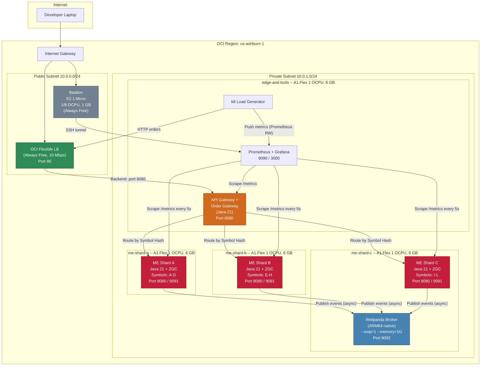

# Cloud Experiment: Oracle Cloud (OCI) Deployment for ASR Validation

## Table of Contents

1. [Overview](#1-overview)
2. [OCI Always Free Tier Analysis](#2-oci-always-free-tier-analysis)
3. [Component-to-OCI-Service Mapping](#3-component-to-oci-service-mapping)
4. [Instance Shapes and Resource Allocation](#4-instance-shapes-and-resource-allocation)
5. [Networking Setup](#5-networking-setup)
6. [Cost Estimation](#6-cost-estimation)
7. [Deployment Topology Diagram](#7-deployment-topology-diagram)
8. [Step-by-Step Deployment Guide](#8-step-by-step-deployment-guide)
9. [Cost Optimization Tips and Gotchas](#9-cost-optimization-tips-and-gotchas)
10. [Terraform Alternative](#10-terraform-alternative)

---

## 1. Overview

This document defines a minimal Oracle Cloud Infrastructure (OCI) deployment for running the architectural experiment to validate both ASRs:

- **ASR 1 (Latency):** Matching execution < 200 ms (p99) at 1,000 matches/min.
- **ASR 2 (Scalability):** Scale from 1,000 to 5,000 matches/min via asset-symbol sharding.

**The headline finding: The entire experiment can run on OCI's Always Free tier at $0.00 total cost.** OCI's Always Free tier includes Ampere A1 (ARM64) instances with 4 OCPUs and 24 GB RAM -- enough to run 3 ME shards, an edge gateway, Redpanda, Prometheus, Grafana, and k6 without paying a cent.

---

## 2. OCI Always Free Tier Analysis

### 2.1 Available Always Free Resources

| Resource | Always Free Allocation | Used by This Experiment |
|:---|:---|:---|
| **Ampere A1 Compute** | 4 OCPUs, 24 GB RAM (split across up to 4 instances) | 4 OCPUs, 24 GB RAM (4 instances) |
| **AMD Micro Compute** | 2x VM.Standard.E2.1.Micro (1/8 OCPU, 1 GB each) | 1 for bastion, 1 spare |
| **Flexible Load Balancer** | 1 LB, 10 Mbps bandwidth | 1 LB (edge ingress) |
| **Boot Volume Storage** | 200 GB total | 200 GB (6 instances, adjusted sizes) |
| **Block Volume Storage** | 200 GB, 5 volumes | Not needed (boot volumes sufficient) |
| **Object Storage** | 10 GB | Available for WAL backup |
| **VCN, Subnets, Gateways** | Unlimited | 1 VCN, 2 subnets |
| **OCI Monitoring** | Basic metrics (free) | Supplemented by self-hosted Prometheus |

### 2.2 Can the Entire Experiment Fit in Always Free?

**YES.** Here is how the 4 A1 OCPUs and 24 GB RAM are distributed:

| Instance | Shape | OCPUs | RAM | Role |
|:---|:---|:---|:---|:---|
| **me-shard-a** | A1.Flex | 1 | 6 GB | ME Shard A (Java 21 + ZGC, symbols A-D) |
| **me-shard-b** | A1.Flex | 1 | 6 GB | ME Shard B (Java 21 + ZGC, symbols E-H) |
| **me-shard-c** | A1.Flex | 1 | 6 GB | ME Shard C + Redpanda co-located (symbols I-L) |
| **edge-and-tools** | A1.Flex | 1 | 6 GB | API GW + Order GW + Prometheus + Grafana + k6 |
| **bastion** | E2.1.Micro | 1/8 | 1 GB | SSH bastion for accessing private instances |
| **Total** | | **4 1/8** | **25 GB** | A1: exactly 4 OCPUs, 24 GB |

The 2 Micro instances are separate from the A1 allocation. The bastion uses 1 Micro; the second is spare.

### 2.3 Boot Volume Adjustment (200 GB Limit)

Default boot volumes are 47 GB, but 6 x 47 = 282 GB exceeds the 200 GB free limit. Adjusted:

| Instance | Boot Volume | Justification |
|:---|:---|:---|
| me-shard-a | 30 GB | Java + ME JAR < 1 GB. WAL < 1 GB for experiment. |
| me-shard-b | 30 GB | Same |
| me-shard-c | 40 GB | Extra for Redpanda data directory |
| edge-and-tools | 40 GB | Prometheus TSDB (7d retention), Grafana, k6 |
| bastion | 30 GB | Minimal: SSH, OCI CLI, scripts |
| spare micro | 30 GB | Minimal (or skip entirely) |
| **Total** | **200 GB** | Exactly within Always Free limit |

---

## 3. Component-to-OCI-Service Mapping

| Architecture Component | OCI Service | Cost | Justification |
|:---|:---|:---|:---|
| **L4 Load Balancer** | OCI Flexible Load Balancer (10 Mbps) | **$0 (Always Free)** | Free tier includes 1 flexible LB. 10 Mbps is sufficient for experiment throughput. |
| **API Gateway + Order Gateway** | Compute A1.Flex (co-located on edge-and-tools) | **$0 (Always Free)** | Stateless. Co-located with monitoring and k6 to save instances. |
| **ME Shard A** | Compute A1.Flex (1 OCPU, 6 GB) | **$0 (Always Free)** | Dedicated OCPU for single-threaded ME. 6 GB for JVM heap + metaspace. |
| **ME Shard B** | Compute A1.Flex (1 OCPU, 6 GB) | **$0 (Always Free)** | Same. |
| **ME Shard C + Redpanda** | Compute A1.Flex (1 OCPU, 6 GB) | **$0 (Always Free)** | Co-located. Redpanda `--smp=1 --memory=1G` + ME `512 MB heap` fit in 6 GB. |
| **Prometheus + Grafana** | Co-located on edge-and-tools | **$0 (Always Free)** | Native ARM64 binaries. |
| **k6 Load Generator** | Co-located on edge-and-tools | **$0 (Always Free)** | Sends traffic within VCN. |
| **Bastion** | Compute E2.1.Micro | **$0 (Always Free)** | SSH jump host for private subnet access. |
| **Redis** | **EXCLUDED** | -- | Not on matching critical path. |
| **OCI Streaming (Kafka)** | **EXCLUDED** | -- | Self-managed Redpanda is free and lower latency. |

---

## 4. Instance Shapes and Resource Allocation

### 4.1 VM.Standard.A1.Flex (Ampere Altra, ARM64)

| Spec | Value |
|:---|:---|
| Processor | Ampere Altra (ARM Neoverse N1), 3.0 GHz |
| OCPU | 1 OCPU = 1 physical core (not hyperthreaded) |
| RAM | 6 GB per OCPU (configurable, up to 64 GB per OCPU) |
| Network | Up to 1 Gbps per OCPU |
| Storage | Boot volume (gp-equivalent, 3,000 IOPS baseline) |
| Java compatibility | Java 21 native ARM64 (Temurin/Corretto/Oracle JDK) |

**Key advantage over AWS c7g.medium:** OCI A1 OCPUs are **physical cores** (not virtual CPUs). 1 A1 OCPU provides the full core's compute power with no hyperthreading neighbor. This gives cleaner, more predictable latency measurements for the experiment.

### 4.2 VM.Standard.E2.1.Micro (AMD EPYC, x86_64)

| Spec | Value |
|:---|:---|
| Processor | AMD EPYC 7551 |
| OCPU | 1/8 OCPU (burstable) |
| RAM | 1 GB |
| Network | ~480 Mbps |
| Use | Bastion only. Too small for any experiment workload. |

### 4.3 Per-Instance Software Allocation

| Instance | Processes | Memory Budget |
|:---|:---|:---|
| **me-shard-a** | ME (JVM: `-Xms512m -Xmx1g`) | 1 GB heap + ~0.5 GB metaspace + OS = ~2.5 GB. 3.5 GB free for OS cache/WAL mmap. |
| **me-shard-b** | ME (same) | Same |
| **me-shard-c** | ME (JVM: `-Xms512m -Xmx1g`) + Redpanda (`--memory=1G`) | ME: ~2.5 GB + Redpanda: ~1.5 GB + OS: ~1 GB = ~5 GB. 1 GB headroom. |
| **edge-and-tools** | API GW (JVM: `-Xms128m -Xmx256m`) + Order GW (JVM: `-Xms128m -Xmx256m`) + Prometheus (~500 MB) + Grafana (~200 MB) + k6 (~100 MB) | ~1.5 GB total processes + OS. 4.5 GB free. Comfortable. |
| **bastion** | sshd + OCI CLI | <100 MB. Trivial. |

---

## 5. Networking Setup

### 5.1 VCN Configuration

```
VCN CIDR: 10.0.0.0/16
DNS Label: mevcn

Subnets (single AD):
  - Public Subnet:  10.0.0.0/24  (LB, bastion)
  - Private Subnet: 10.0.1.0/24  (ME shards, edge-and-tools)
```

### 5.2 Gateways

| Component | Purpose | Cost |
|:---|:---|:---|
| **Internet Gateway** | Public subnet access for LB and bastion | Free |
| **NAT Gateway** | Private subnet outbound (package installation) | Free (Always Free includes 1 NAT GW) |

### 5.3 Security Lists

| Security List | Inbound Rules | Applied To |
|:---|:---|:---|
| **public-sl** | TCP 22 from your IP; TCP 80 from 0.0.0.0/0 (LB listener) | Public subnet |
| **private-sl** | TCP 22 from 10.0.0.0/16; TCP 3000 from 10.0.0.0/16 (Grafana); TCP 8080 from 10.0.0.0/16 (orders); TCP 9090-9092 from 10.0.0.0/16 (Prometheus, metrics, Kafka); TCP 9091 from 10.0.0.0/16 (ME metrics) | Private subnet |

### 5.4 Load Balancer Configuration

| Attribute | Value |
|:---|:---|
| Shape | Flexible (10 Mbps min, 10 Mbps max) -- Always Free |
| Subnet | Public subnet |
| Backend set | Round robin, health check on port 8080 `/health` |
| Backend | edge-and-tools instance, port 8080 |
| Listener | HTTP, port 80 |

**10 Mbps bandwidth analysis:** At 5,000 orders/min with ~1 KB per order = ~5 MB/min = ~0.67 Mbps. The 10 Mbps LB has over 14x headroom. Sufficient for the experiment.

---

## 6. Cost Estimation

### 6.1 Always Free Deployment (Recommended)

| Component | OCI Service | Monthly Cost |
|:---|:---|:---|
| ME Shard A (1 OCPU, 6 GB) | A1.Flex | **$0.00** |
| ME Shard B (1 OCPU, 6 GB) | A1.Flex | **$0.00** |
| ME Shard C + Redpanda (1 OCPU, 6 GB) | A1.Flex | **$0.00** |
| Edge + Tools (1 OCPU, 6 GB) | A1.Flex | **$0.00** |
| Bastion (1/8 OCPU, 1 GB) | E2.1.Micro | **$0.00** |
| Load Balancer (10 Mbps) | Flexible LB | **$0.00** |
| Boot volumes (200 GB total) | Block storage | **$0.00** |
| VCN + Subnets + Gateways | Networking | **$0.00** |
| **TOTAL** | | **$0.00/month** |

### 6.2 If Always Free Tier Is Exhausted (Paid Fallback)

If A1 instances are unavailable (capacity constraints), paid alternatives:

| Instance | Shape | Cost/hr | Cost/week (168 hrs) |
|:---|:---|:---|:---|
| A1.Flex (1 OCPU, 6 GB) | VM.Standard.A1.Flex | $0.01/OCPU + $0.0015/GB = $0.019/hr | $3.19 |
| 4x A1.Flex instances | | $0.076/hr | $12.77 |
| E4.Flex (1 OCPU, 6 GB) | VM.Standard.E4.Flex | ~$0.03/OCPU + $0.0015/GB = $0.039/hr | $6.55 |
| Preemptible A1 (50% off) | | $0.0095/hr per instance | $6.38 for 4 instances |
| **Worst case (4x A1 paid + LB + storage)** | | | **~$15/week** |

### 6.3 Comparison with AWS

| Metric | OCI Always Free | AWS (cheapest) |
|:---|:---|:---|
| **Total cost (1 week)** | **$0.00** | **$8-10** |
| **Total cost (1 month)** | **$0.00** | **$34** |
| Compute per ME shard | 1 physical OCPU, 6 GB | 1 vCPU, 2 GB |
| LB cost | $0 | $19/month |
| Operational complexity | Moderate (OCI CLI less familiar) | Lower (AWS CLI widely known) |

---

## 7. Deployment Topology Diagram



---

## 8. Step-by-Step Deployment Guide

### Phase 0: Prerequisites

```bash
# 0.1: Create an OCI Always Free account at https://cloud.oracle.com
#      Select Home Region: us-ashburn-1 (best A1 availability)

# 0.2: Install OCI CLI
brew install oci-cli
oci setup config  # Configure tenancy, user, region, API keys

# 0.3: Verify OCI CLI
oci iam region list --output table

# 0.4: Generate SSH key pair
ssh-keygen -t ed25519 -f ~/.ssh/oci-me-experiment -N ""
```

### Phase 1: Create VCN and Networking

```bash
# Get compartment ID
COMPARTMENT_ID=$(oci iam compartment list \
  --query "data[0].id" --raw-output)

# Create VCN
VCN_ID=$(oci network vcn create \
  --compartment-id $COMPARTMENT_ID \
  --display-name "matching-engine-exp-vcn" \
  --cidr-blocks '["10.0.0.0/16"]' \
  --dns-label "mevcn" \
  --query "data.id" --raw-output \
  --wait-for-state AVAILABLE)

# Create Internet Gateway
IGW_ID=$(oci network internet-gateway create \
  --compartment-id $COMPARTMENT_ID \
  --vcn-id $VCN_ID \
  --display-name "me-igw" \
  --is-enabled true \
  --query "data.id" --raw-output \
  --wait-for-state AVAILABLE)

# Create NAT Gateway
NAT_ID=$(oci network nat-gateway create \
  --compartment-id $COMPARTMENT_ID \
  --vcn-id $VCN_ID \
  --display-name "me-nat" \
  --query "data.id" --raw-output \
  --wait-for-state AVAILABLE)

# Create Route Tables
PUBLIC_RT_ID=$(oci network route-table create \
  --compartment-id $COMPARTMENT_ID \
  --vcn-id $VCN_ID \
  --display-name "public-rt" \
  --route-rules "[{\"destination\":\"0.0.0.0/0\",\"destinationType\":\"CIDR_BLOCK\",\"networkEntityId\":\"$IGW_ID\"}]" \
  --query "data.id" --raw-output \
  --wait-for-state AVAILABLE)

PRIVATE_RT_ID=$(oci network route-table create \
  --compartment-id $COMPARTMENT_ID \
  --vcn-id $VCN_ID \
  --display-name "private-rt" \
  --route-rules "[{\"destination\":\"0.0.0.0/0\",\"destinationType\":\"CIDR_BLOCK\",\"networkEntityId\":\"$NAT_ID\"}]" \
  --query "data.id" --raw-output \
  --wait-for-state AVAILABLE)

# Create Security Lists
PUBLIC_SL_ID=$(oci network security-list create \
  --compartment-id $COMPARTMENT_ID \
  --vcn-id $VCN_ID \
  --display-name "public-sl" \
  --ingress-security-rules '[{"protocol":"6","source":"0.0.0.0/0","tcpOptions":{"destinationPortRange":{"min":22,"max":22}}}]' \
  --egress-security-rules '[{"protocol":"all","destination":"0.0.0.0/0"}]' \
  --query "data.id" --raw-output \
  --wait-for-state AVAILABLE)

PRIVATE_SL_ID=$(oci network security-list create \
  --compartment-id $COMPARTMENT_ID \
  --vcn-id $VCN_ID \
  --display-name "private-sl" \
  --ingress-security-rules '[{"protocol":"6","source":"10.0.0.0/16","tcpOptions":{"destinationPortRange":{"min":22,"max":22}}},{"protocol":"6","source":"10.0.0.0/16","tcpOptions":{"destinationPortRange":{"min":3000,"max":3000}}},{"protocol":"6","source":"10.0.0.0/16","tcpOptions":{"destinationPortRange":{"min":8080,"max":8080}}},{"protocol":"6","source":"10.0.0.0/16","tcpOptions":{"destinationPortRange":{"min":9090,"max":9092}}},{"protocol":"6","source":"10.0.0.0/16","tcpOptions":{"destinationPortRange":{"min":9091,"max":9091}}}]' \
  --egress-security-rules '[{"protocol":"all","destination":"0.0.0.0/0"}]' \
  --query "data.id" --raw-output \
  --wait-for-state AVAILABLE)

# Get Availability Domain
AD=$(oci iam availability-domain list \
  --compartment-id $COMPARTMENT_ID \
  --query "data[0].name" --raw-output)

# Create Subnets
PUBLIC_SUBNET_ID=$(oci network subnet create \
  --compartment-id $COMPARTMENT_ID \
  --vcn-id $VCN_ID \
  --display-name "public-subnet" \
  --cidr-block "10.0.0.0/24" \
  --route-table-id $PUBLIC_RT_ID \
  --security-list-ids "[\"$PUBLIC_SL_ID\"]" \
  --dns-label "pubsub" \
  --query "data.id" --raw-output \
  --wait-for-state AVAILABLE)

PRIVATE_SUBNET_ID=$(oci network subnet create \
  --compartment-id $COMPARTMENT_ID \
  --vcn-id $VCN_ID \
  --display-name "private-subnet" \
  --cidr-block "10.0.1.0/24" \
  --route-table-id $PRIVATE_RT_ID \
  --security-list-ids "[\"$PRIVATE_SL_ID\"]" \
  --prohibit-public-ip-on-vnic true \
  --dns-label "privsub" \
  --query "data.id" --raw-output \
  --wait-for-state AVAILABLE)
```

### Phase 2: Create Compute Instances

```bash
# Get ARM64 Oracle Linux 9 image
ARM64_IMAGE=$(oci compute image list \
  --compartment-id $COMPARTMENT_ID \
  --operating-system "Oracle Linux" \
  --operating-system-version "9" \
  --shape "VM.Standard.A1.Flex" \
  --sort-by TIMECREATED --sort-order DESC \
  --query "data[0].id" --raw-output)

# Get x86_64 image (for Micro)
X86_IMAGE=$(oci compute image list \
  --compartment-id $COMPARTMENT_ID \
  --operating-system "Oracle Linux" \
  --operating-system-version "9" \
  --shape "VM.Standard.E2.1.Micro" \
  --sort-by TIMECREATED --sort-order DESC \
  --query "data[0].id" --raw-output)

SSH_KEY=$(cat ~/.ssh/oci-me-experiment.pub)

# Bastion (Micro, public subnet)
BASTION_ID=$(oci compute instance launch \
  --compartment-id $COMPARTMENT_ID \
  --availability-domain $AD \
  --display-name "me-bastion" \
  --shape "VM.Standard.E2.1.Micro" \
  --image-id $X86_IMAGE \
  --subnet-id $PUBLIC_SUBNET_ID \
  --assign-public-ip true \
  --boot-volume-size-in-gbs 30 \
  --ssh-authorized-keys-file ~/.ssh/oci-me-experiment.pub \
  --query "data.id" --raw-output \
  --wait-for-state RUNNING)

# ME Shard A (A1.Flex, 1 OCPU, 6 GB)
ME_A_ID=$(oci compute instance launch \
  --compartment-id $COMPARTMENT_ID \
  --availability-domain $AD \
  --display-name "me-shard-a" \
  --shape "VM.Standard.A1.Flex" \
  --shape-config '{"ocpus":1,"memoryInGBs":6}' \
  --image-id $ARM64_IMAGE \
  --subnet-id $PRIVATE_SUBNET_ID \
  --assign-public-ip false \
  --boot-volume-size-in-gbs 30 \
  --ssh-authorized-keys-file ~/.ssh/oci-me-experiment.pub \
  --query "data.id" --raw-output \
  --wait-for-state RUNNING)

# ME Shard B (same config)
ME_B_ID=$(oci compute instance launch \
  --compartment-id $COMPARTMENT_ID \
  --availability-domain $AD \
  --display-name "me-shard-b" \
  --shape "VM.Standard.A1.Flex" \
  --shape-config '{"ocpus":1,"memoryInGBs":6}' \
  --image-id $ARM64_IMAGE \
  --subnet-id $PRIVATE_SUBNET_ID \
  --assign-public-ip false \
  --boot-volume-size-in-gbs 30 \
  --ssh-authorized-keys-file ~/.ssh/oci-me-experiment.pub \
  --query "data.id" --raw-output \
  --wait-for-state RUNNING)

# ME Shard C + Redpanda (co-located)
ME_C_ID=$(oci compute instance launch \
  --compartment-id $COMPARTMENT_ID \
  --availability-domain $AD \
  --display-name "me-shard-c" \
  --shape "VM.Standard.A1.Flex" \
  --shape-config '{"ocpus":1,"memoryInGBs":6}' \
  --image-id $ARM64_IMAGE \
  --subnet-id $PRIVATE_SUBNET_ID \
  --assign-public-ip false \
  --boot-volume-size-in-gbs 40 \
  --ssh-authorized-keys-file ~/.ssh/oci-me-experiment.pub \
  --query "data.id" --raw-output \
  --wait-for-state RUNNING)

# Edge + Tools
EDGE_ID=$(oci compute instance launch \
  --compartment-id $COMPARTMENT_ID \
  --availability-domain $AD \
  --display-name "edge-and-tools" \
  --shape "VM.Standard.A1.Flex" \
  --shape-config '{"ocpus":1,"memoryInGBs":6}' \
  --image-id $ARM64_IMAGE \
  --subnet-id $PRIVATE_SUBNET_ID \
  --assign-public-ip false \
  --boot-volume-size-in-gbs 40 \
  --ssh-authorized-keys-file ~/.ssh/oci-me-experiment.pub \
  --query "data.id" --raw-output \
  --wait-for-state RUNNING)

# Get private IPs
ME_A_IP=$(oci compute instance list-vnics \
  --instance-id $ME_A_ID \
  --query "data[0].\"private-ip\"" --raw-output)
ME_B_IP=$(oci compute instance list-vnics \
  --instance-id $ME_B_ID \
  --query "data[0].\"private-ip\"" --raw-output)
ME_C_IP=$(oci compute instance list-vnics \
  --instance-id $ME_C_ID \
  --query "data[0].\"private-ip\"" --raw-output)
EDGE_IP=$(oci compute instance list-vnics \
  --instance-id $EDGE_ID \
  --query "data[0].\"private-ip\"" --raw-output)
BASTION_IP=$(oci compute instance list-vnics \
  --instance-id $BASTION_ID \
  --query "data[0].\"public-ip\"" --raw-output)

echo "Bastion: $BASTION_IP"
echo "Edge: $EDGE_IP | ME-A: $ME_A_IP | ME-B: $ME_B_IP | ME-C: $ME_C_IP"
```

### Phase 3: Create Load Balancer

```bash
# Create Flexible LB (Always Free, 10 Mbps)
LB_ID=$(oci lb load-balancer create \
  --compartment-id $COMPARTMENT_ID \
  --display-name "me-experiment-lb" \
  --shape-name "flexible" \
  --shape-details '{"minimumBandwidthInMbps":10,"maximumBandwidthInMbps":10}' \
  --subnet-ids "[\"$PUBLIC_SUBNET_ID\"]" \
  --is-private false \
  --query "data.id" --raw-output \
  --wait-for-state SUCCEEDED)

# Create Backend Set
oci lb backend-set create \
  --load-balancer-id $LB_ID \
  --name "gateway-backends" \
  --policy "ROUND_ROBIN" \
  --health-checker-protocol "HTTP" \
  --health-checker-url-path "/health" \
  --health-checker-port 8080 \
  --health-checker-interval-in-millis 10000 \
  --wait-for-state SUCCEEDED

# Add edge instance as backend
oci lb backend create \
  --load-balancer-id $LB_ID \
  --backend-set-name "gateway-backends" \
  --ip-address $EDGE_IP \
  --port 8080 \
  --wait-for-state SUCCEEDED

# Create Listener
oci lb listener create \
  --load-balancer-id $LB_ID \
  --name "http-listener" \
  --default-backend-set-name "gateway-backends" \
  --protocol "HTTP" \
  --port 80 \
  --wait-for-state SUCCEEDED

# Get LB public IP
LB_PUBLIC_IP=$(oci lb load-balancer get \
  --load-balancer-id $LB_ID \
  --query "data.\"ip-addresses\"[0].\"ip-address\"" --raw-output)
echo "Load Balancer IP: $LB_PUBLIC_IP"
```

### Phase 4: Provision Software on Instances

Access instances via SSH through the bastion:

```bash
# SSH tunnel through bastion to any private instance
ssh -i ~/.ssh/oci-me-experiment -J opc@$BASTION_IP opc@$ME_A_IP
```

#### On each ME instance (me-shard-a, me-shard-b, me-shard-c):

```bash
# Install Java 21 (ARM64)
sudo dnf install -y java-21-openjdk java-21-openjdk-devel
java --version   # Verify: openjdk 21.x.x aarch64

# Create app directory
sudo mkdir -p /opt/matching-engine
sudo chown opc:opc /opt/matching-engine

# Upload ME JAR via scp through bastion
# scp -J opc@$BASTION_IP matching-engine.jar opc@$ME_A_IP:/opt/matching-engine/

# Create systemd service
sudo tee /etc/systemd/system/matching-engine.service << 'EOF'
[Unit]
Description=Matching Engine Shard
After=network.target

[Service]
Type=simple
User=opc
WorkingDirectory=/opt/matching-engine
ExecStart=/usr/bin/java \
  -XX:+UseZGC \
  -Xms512m -Xmx1g \
  -XX:+AlwaysPreTouch \
  -Dserver.port=8080 \
  -Dmetrics.port=9091 \
  -Dshard.id=a \
  -Dshard.symbols=TEST-ASSET-A,TEST-ASSET-B,TEST-ASSET-C,TEST-ASSET-D \
  -Dkafka.bootstrap=${ME_C_IP}:9092 \
  -jar matching-engine.jar
Restart=on-failure
RestartSec=5

[Install]
WantedBy=multi-user.target
EOF

sudo systemctl daemon-reload
sudo systemctl enable matching-engine
sudo systemctl start matching-engine
```

#### On me-shard-c: additionally install Redpanda:

```bash
# Install Redpanda (ARM64)
curl -1sLf 'https://dl.redpanda.com/nzc4ZYQK3WRGd9sy/redpanda/cfg/setup/bash.rpm.sh' \
  | sudo -E bash
sudo dnf install -y redpanda

# Configure for minimal resources
sudo rpk redpanda config set redpanda.developer_mode true
sudo rpk redpanda config set rpk.overprovisioned true

# Start Redpanda
sudo systemctl enable redpanda
sudo systemctl start redpanda

# Create topics
rpk topic create orders --partitions 12 --replicas 1
rpk topic create matches --partitions 12 --replicas 1
```

#### On edge-and-tools: install all tools:

```bash
# Java 21 (API GW + Order GW)
sudo dnf install -y java-21-openjdk

# Prometheus (ARM64 binary)
PROM_VERSION="2.51.0"
wget https://github.com/prometheus/prometheus/releases/download/v${PROM_VERSION}/prometheus-${PROM_VERSION}.linux-arm64.tar.gz
tar xzf prometheus-${PROM_VERSION}.linux-arm64.tar.gz
sudo mv prometheus-${PROM_VERSION}.linux-arm64 /opt/prometheus

# Configure Prometheus
cat > /opt/prometheus/prometheus.yml << EOF
global:
  scrape_interval: 5s
scrape_configs:
  - job_name: 'matching-engine'
    static_configs:
      - targets:
        - '${ME_A_IP}:9091'
        - '${ME_B_IP}:9091'
        - '${ME_C_IP}:9091'
  - job_name: 'gateway'
    static_configs:
      - targets: ['localhost:9091']
EOF

nohup /opt/prometheus/prometheus \
  --config.file=/opt/prometheus/prometheus.yml \
  --storage.tsdb.retention.time=7d \
  --web.listen-address=":9090" \
  --web.enable-remote-write-receiver &

# Grafana (ARM64 RPM)
sudo dnf install -y https://dl.grafana.com/oss/release/grafana-10.4.1-1.aarch64.rpm
sudo systemctl enable grafana-server
sudo systemctl start grafana-server
# Grafana on port 3000, default: admin/admin

# k6 (ARM64)
sudo dnf install -y https://dl.k6.io/rpm/repo/k6-latest.aarch64.rpm
```

### Phase 5: Run Experiments

```bash
# SSH tunnel for Grafana access from your laptop
ssh -i ~/.ssh/oci-me-experiment \
  -L 3000:$EDGE_IP:3000 \
  -L 9090:$EDGE_IP:9090 \
  opc@$BASTION_IP

# From edge-and-tools instance, run ASR 1 test
k6 run \
  --out experimental-prometheus-rw=http://localhost:9090/api/v1/write \
  /opt/k6-scripts/test-asr1-latency.js

# Run ASR 2 test
k6 run \
  --out experimental-prometheus-rw=http://localhost:9090/api/v1/write \
  /opt/k6-scripts/test-asr2-scalability.js

# View results in Grafana at http://localhost:3000
```

### Phase 6: Teardown

```bash
# Terminate all instances
for INST_ID in $ME_A_ID $ME_B_ID $ME_C_ID $EDGE_ID $BASTION_ID; do
  oci compute instance terminate \
    --instance-id $INST_ID \
    --preserve-boot-volume false --force
done

# Delete Load Balancer
oci lb load-balancer delete --load-balancer-id $LB_ID --force

# Delete networking (in dependency order)
oci network subnet delete --subnet-id $PRIVATE_SUBNET_ID --force
oci network subnet delete --subnet-id $PUBLIC_SUBNET_ID --force
oci network nat-gateway delete --nat-gateway-id $NAT_ID --force
oci network internet-gateway delete --ig-id $IGW_ID --force
oci network route-table delete --rt-id $PRIVATE_RT_ID --force
oci network route-table delete --rt-id $PUBLIC_RT_ID --force
# Wait for above to complete, then:
oci network vcn delete --vcn-id $VCN_ID --force
```

---

## 9. Cost Optimization Tips and Gotchas

### 9.1 Optimizations Already Applied

| Optimization | Savings |
|:---|:---|
| Use OCI Always Free A1 instances | $54.72/month saved vs paid A1 |
| Use Always Free Flexible LB | $10.08/month saved |
| Self-managed Redpanda instead of OCI Streaming | ~$100+/month saved |
| Self-managed Prometheus/Grafana instead of OCI APM | ~$50+/month saved |
| Skip Redis | ~$75/month saved |
| Co-locate ME Shard C + Redpanda | Saves 1 A1 instance |
| Co-locate Gateway + Prometheus + Grafana + k6 | Saves 3 A1 instances |
| No Docker/containers; native JAR execution | Saves ~50-100 MB RAM per process |

### 9.2 Always Free Gotchas

| Gotcha | Mitigation |
|:---|:---|
| **A1 capacity often exhausted** in popular regions | Try multiple ADs. Retry at off-peak hours (US night/weekend). Try `sa-saopaulo-1` or `ap-melbourne-1` if Ashburn fails. Write a retry script. |
| **Idle instances reclaimed after 7 days** of CPU < 10% | Keep instances active during testing. For bastion, run a small periodic cron job. |
| **Boot volume total limit is 200 GB** | Reduce to 30-40 GB per instance (see Section 2.3). |
| **"Out of Host Capacity" on A1 creation** | Most common issue. Script retries every 5 minutes. Usually succeeds within 1-2 hours. |

### 9.3 Phased Instance Usage

Since Always Free is exactly 4 A1 OCPUs, optimize per experiment phase:

| Phase | Instances Running | A1 OCPUs Used | Purpose |
|:---|:---|:---|:---|
| ASR 1 (latency) | me-shard-a + edge-and-tools | 2 of 4 | Single shard latency test |
| ASR 1 (decoupling) | me-shard-a + me-shard-c (Redpanda) + edge-and-tools | 3 of 4 | Kafka degradation test |
| ASR 2 (scalability) | all 4 A1 instances | 4 of 4 | Full 3-shard scale test |

### 9.4 If A1 Is Unavailable: Paid Fallback

| Option | Cost/hr | Cost/week |
|:---|:---|:---|
| Preemptible A1 (50% discount) | $0.0095/instance | $1.60/instance |
| E4.Flex (AMD, x86_64) | $0.039/instance | $6.55/instance |
| Standard3.Flex (Intel) | $0.054/instance | $9.07/instance |

---

## 10. Terraform Alternative

For reproducibility, the deployment can be expressed as a Terraform module:

```hcl
# main.tf -- OCI Matching Engine Experiment

terraform {
  required_providers {
    oci = {
      source  = "oracle/oci"
      version = "~> 5.0"
    }
  }
}

provider "oci" {
  region = "us-ashburn-1"
}

variable "compartment_id" {
  description = "OCI Compartment OCID"
  type        = string
}

variable "ssh_public_key" {
  description = "SSH public key for instance access"
  type        = string
}

# VCN
resource "oci_core_vcn" "me_vcn" {
  compartment_id = var.compartment_id
  display_name   = "matching-engine-exp-vcn"
  cidr_blocks    = ["10.0.0.0/16"]
  dns_label      = "mevcn"
}

resource "oci_core_internet_gateway" "me_igw" {
  compartment_id = var.compartment_id
  vcn_id         = oci_core_vcn.me_vcn.id
  display_name   = "me-igw"
  enabled        = true
}

resource "oci_core_nat_gateway" "me_nat" {
  compartment_id = var.compartment_id
  vcn_id         = oci_core_vcn.me_vcn.id
  display_name   = "me-nat"
}

# ME Shard A
data "oci_core_images" "arm64_ol9" {
  compartment_id           = var.compartment_id
  operating_system         = "Oracle Linux"
  operating_system_version = "9"
  shape                    = "VM.Standard.A1.Flex"
  sort_by                  = "TIMECREATED"
  sort_order               = "DESC"
}

resource "oci_core_instance" "me_shard_a" {
  compartment_id      = var.compartment_id
  availability_domain = data.oci_identity_availability_domains.ads.availability_domains[0].name
  display_name        = "me-shard-a"
  shape               = "VM.Standard.A1.Flex"

  shape_config {
    ocpus         = 1
    memory_in_gbs = 6
  }

  source_details {
    source_id               = data.oci_core_images.arm64_ol9.images[0].id
    source_type             = "image"
    boot_volume_size_in_gbs = 30
  }

  create_vnic_details {
    subnet_id        = oci_core_subnet.private_subnet.id
    assign_public_ip = false
  }

  metadata = {
    ssh_authorized_keys = var.ssh_public_key
  }
}

# Repeat for me_shard_b, me_shard_c, edge_and_tools, bastion...
# Add route tables, security lists, subnets, LB following same pattern.

# Load Balancer (Always Free)
resource "oci_load_balancer_load_balancer" "me_lb" {
  compartment_id = var.compartment_id
  display_name   = "me-experiment-lb"
  shape          = "flexible"

  shape_details {
    minimum_bandwidth_in_mbps = 10
    maximum_bandwidth_in_mbps = 10
  }

  subnet_ids = [oci_core_subnet.public_subnet.id]
  is_private = false
}
```

Use `terraform apply` to create the entire environment and `terraform destroy` for clean teardown.

---

## Key Decisions Summary

| Decision | Choice | Rationale |
|:---|:---|:---|
| **Cloud provider** | OCI | Always Free tier: 4 ARM64 OCPUs, 24 GB RAM, free LB. **$0.00 total cost.** |
| **Instance shape** | VM.Standard.A1.Flex | 1 physical OCPU per shard (no hyperthreading). Java 21 native ARM64. |
| **No Kubernetes** | Direct VM + systemd | k3d overhead unjustified on 1-OCPU instances. VMs give clearer resource isolation. |
| **No Docker** | Native JAR execution | Saves ~50-100 MB RAM per process. |
| **Redpanda co-located with ME Shard C** | Saves 1 A1 instance | Both fit in 6 GB. |
| **All tools on one instance** | Gateway + Prometheus + Grafana + k6 co-located | Saves 3 instances. 1 OCPU / 6 GB is sufficient. |
| **Region** | us-ashburn-1 | Best A1 availability. |

**Bottom line:** The entire experiment -- edge layer, 3 ME shards, Redpanda, Prometheus, Grafana, k6, and a bastion -- runs on OCI's Always Free tier at **$0.00 total cost**. OCI's Ampere A1 instances provide dedicated physical OCPUs (not hyperthreaded vCPUs), making them well-suited for latency-sensitive experiments.

---

*Related documents:*
- *[Experiment Design (Local)](./experiment-design.md)*
- *[Cloud Experiment: AWS](./experiment-cloud-aws.md)*
- *[Initial Architecture](./architecture/initial-architecture.md)*
